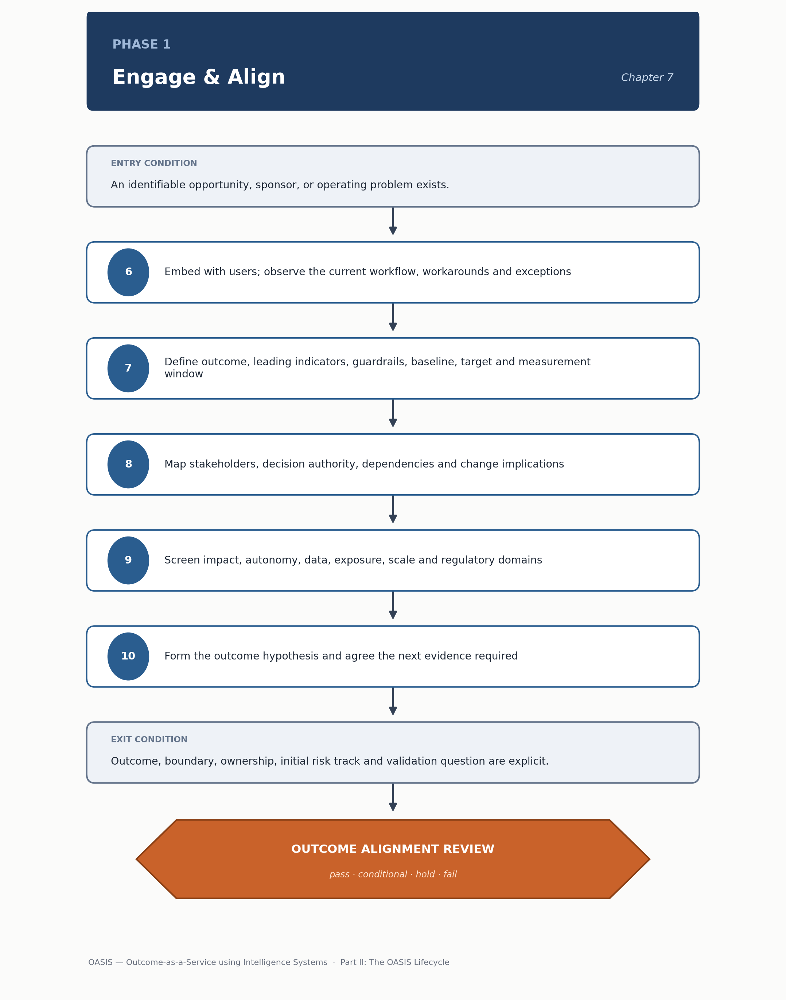

<!-- SPDX-License-Identifier: MIT -->

[← Previous: Part II: The OASIS Lifecycle](part-ii-the-oasis-lifecycle.md) · [Contents](../README.md) · [Next: Chapter 08: Phase 2 — Discover & Validate →](chapter-08-phase-2-discover-and-validate.md)

# Chapter 07: Phase 1 — Engage & Align

# Phase 1 — Engage & Align

> **CHAPTER PURPOSE** Create an owned and measurable outcome contract, define the deployment boundary and decide whether the opportunity merits structured validation.

*Figure 6. Phase 1 — Engage & Align: method sequence and the Outcome Alignment Review gate.*

## Background and context

Every OASIS engagement begins here because every failure mode the later phases exist to catch traces back to a decision this phase either made explicit or left implicit. A team that starts building before an outcome is named, before a baseline exists, and before someone with real authority has agreed to own the result is not saving time — it is deferring the hardest conversation to a point where the sunk cost of a working prototype makes that conversation much harder to have honestly. Phase 1 exists to force that conversation early, while it is still cheap, and to produce a small set of artifacts that everything downstream can be checked against.

This phase has no predecessor in the six-phase lifecycle; it is where an opportunity — surfaced through the portfolio process described in [Chapter 5](chapter-05-opportunity-portfolio-and-transformation-horizons.md) or raised directly by a sponsor — first becomes a scoped, owned piece of work. What it hands to [Phase 2 — Discover & Validate](chapter-08-phase-2-discover-and-validate.md) is not a solution but a well-formed question: a hypothesis about an outcome, a boundary within which to test it, and enough context about ownership and risk that the discovery team knows what "done" would look like before they start. If Phase 1 is rushed, Phase 2 inherits an ambiguous target and spends its budget re-litigating scope instead of testing whether intelligence can actually help.

The primary artifacts named below — the Opportunity Assessment and Outcome Charter chief among them — are not paperwork for its own sake; they are the fillable templates in [Outcome and Portfolio Templates](../tools/01-outcome-and-portfolio-templates.md#1-opportunity-assessment), and the capability this phase is scoping against should trace to an entry in the [capability map](../architecture/perspective-01-business-and-capability-architecture.md#1-capability-map-template) described in Architecture Perspective 1. Teams that skip that cross-check often discover, well into Phase 3, that the capability they engineered against was never mapped to a business owner in the first place.

## Phase objective

Establish the measurable outcome, baseline, deployment boundary, ownership, value logic and initial guardrails.

The objective sounds like a checklist, but it is really a single discipline applied six times: nothing proceeds until it can be stated in terms that a skeptical outsider could verify. "The outcome" is not "use AI to help with X" — it is a specific metric, moving in a specific direction, measured against a specific baseline, within a specific population. "Ownership" is not a sponsor's name attached to a slide — it is a named individual who will still be answering for the result a year from now, after the initial enthusiasm has faded and the system either delivered or didn't. Guardrails at this stage are deliberately provisional; the point is not to anticipate every failure mode on day one, but to write down the ones that are already visible so that Phase 2's evaluation design has somewhere to start.

## Core questions

- Is the outcome valuable and measurable?

- Can the proposed intelligence influence it?

- Who owns the process, result, service and risk?

- What is inside and outside the initial boundary?

These four questions look simple, and teams that answer them glibly usually pay for it later. "Is the outcome valuable and measurable" fails more often on the second half than the first — plenty of opportunities are obviously valuable in a general sense but resist being pinned to a number anyone will trust six months on. "Can the proposed intelligence influence it" is a causal question, not a technical one: it asks whether the workflow this system touches is actually upstream of the metric, or whether the metric is driven mostly by factors outside the system's reach. The ownership question routinely surfaces the awkward fact that no single person owns the process end to end — which is itself a finding worth surfacing before, not after, a system is built to serve it. And the boundary question is where most scope creep gets prevented or invited: what is explicitly out of scope matters as much as what is in.

## Method

6.  Embed briefly with users and observe the current workflow, including informal workarounds and exceptions.

7.  Define the primary outcome, leading indicators, guardrails, baseline, target and measurement window.

8.  Map stakeholders, affected groups, decision authority, dependencies and change implications.

9.  Screen impact, autonomy, data, exposure, scale and applicable regulatory domains.

10. Form the outcome hypothesis and agree the next evidence required.

The numbering continues from earlier chapters' shared method sequence, and the order is deliberate: observation comes before definition. Teams that write the Outcome Charter before spending time with the people actually doing the work tend to design against an idealized version of the process rather than the one that exists, complete with its informal workarounds and the exceptions nobody put in the process documentation. Steps 7 through 9 turn that observation into the specific numbers and boundaries the phase objective calls for, and the regulatory screen in step 9 is not a compliance afterthought — catching an EU AI Act high-risk classification or a DPDP Act personal-data footprint here, while the boundary is still adjustable, is far cheaper than catching it after Phase 3 has built against an unscoped assumption. Step 10 closes the loop: the outcome of Phase 1 is not certainty, it is a well-formed hypothesis and a clear statement of what evidence would confirm or kill it.

## Primary artifacts

- Opportunity Assessment

- Outcome Charter

- Outcome Metric Tree

- Initial Value and Risk Case

- Stakeholder and Ownership Map

- Decision and Assumption Register

Fillable versions of the first five of these live in [Outcome and Portfolio Templates](../tools/01-outcome-and-portfolio-templates.md) — the Opportunity Assessment, Outcome Charter, Outcome Metric Tree and Value and Risk Case are templates 1, 2, 4 and 5 respectively, each stating the minimum content a reviewer should expect before treating the artifact as complete. None of these documents needs to be long. A well-run Phase 1 can produce a one-page Outcome Charter for a low-risk initiative; what matters is that every field a downstream gate will ask about is answered with a real value, not a placeholder.

> **DECISION OUTCOME** Outcome Alignment Review: commit, refine, defer or decline.

## Entry and exit conditions

| **Entry condition**                                               | **Exit condition**                                                                         |
|---------------------------------------------------------------------|--------------------------------------------------------------------------------------------|
| An identifiable opportunity, sponsor or operating problem exists. | The outcome, boundary, ownership, initial risk track and validation question are explicit. |

The entry bar is intentionally low — almost anything with a named sponsor can start Phase 1, because the phase's job is precisely to determine whether the opportunity merits the investment of Phase 2. The exit bar is where the real filtering happens. "Explicit" is the operative word in the exit condition: not agreed in a meeting and forgotten, but written down in artifacts that the Outcome Alignment Review can inspect and that Phase 2 can be held to.

## Tailoring guidance

For a small or low-risk initiative, use one concise Outcome-and-Risk Brief. For cross-business or regulated work, require explicit baselines, legal applicability, funding and independent challenge.

The tailoring principle that runs through this entire methodology applies here in its purest form: the artifacts exist to support a decision, and the depth of the artifact should match the consequence of the decision, not the other way around. A single-team productivity tool with no customer exposure and no regulated data does not need the same Value and Risk Case as a system that will make or influence decisions about customers' money, health or legal standing. What should never be tailored away, regardless of scale, is the requirement that someone with real authority has actually committed to owning the outcome.

---

[← Previous: Part II: The OASIS Lifecycle](part-ii-the-oasis-lifecycle.md) · [Contents](../README.md) · [Next: Chapter 08: Phase 2 — Discover & Validate →](chapter-08-phase-2-discover-and-validate.md)

© 2026 OASIS Methodology contributors. Licensed under the [MIT License](../LICENSE.md).
