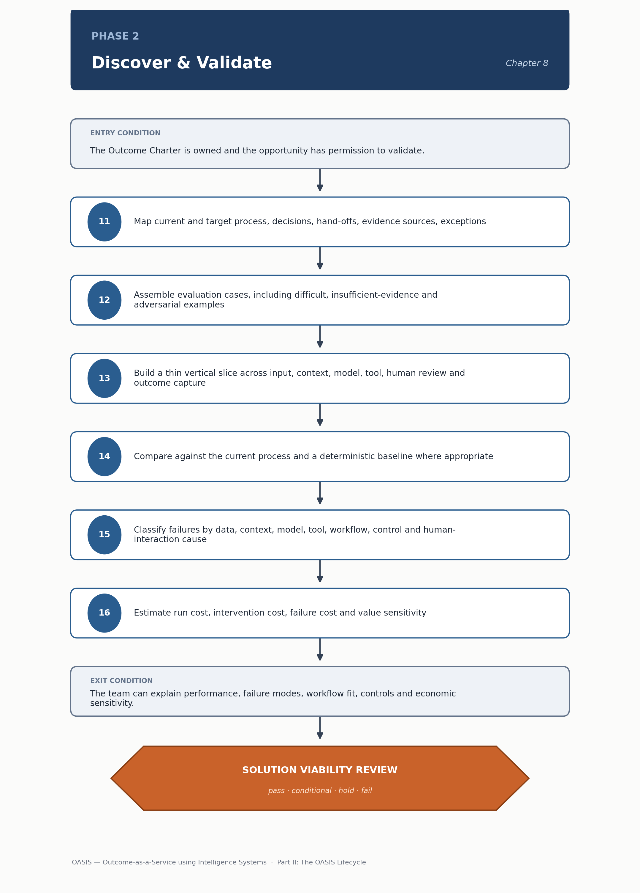

<!-- SPDX-License-Identifier: MIT -->

[← Previous: Chapter 07: Phase 1 — Engage & Align](chapter-07-phase-1-engage-and-align.md) · [Contents](../README.md) · [Next: Chapter 09: Phase 3 — Engineer & Integrate →](chapter-09-phase-3-engineer-and-integrate.md)

# Chapter 08: Phase 2 — Discover & Validate

# Phase 2 — Discover & Validate

> **CHAPTER PURPOSE** Prove that intelligence can materially improve the real workflow on representative cases with acceptable quality, safety, adoption and economics.

## Background and context

Phase 1 produces a hypothesis; Phase 2 tests it honestly before real budget goes into production engineering. Engage & Align asks whether an outcome is worth pursuing; Discover & Validate asks whether intelligence applied to this workflow works well enough, on the cases that matter, to justify building it. A team that jumps from a promising demo to a production build has never tested the hypothesis, only illustrated it.

The discipline this phase enforces is representativeness. It is easy to make a model look capable on hand-picked examples; it is harder, and more informative, to test it on exceptions and ambiguous cases where evidence is thin. A vertical slice that only sees the happy path tells you nothing about production, where the happy path is a minority of real traffic. This is also where the team tests whether users can actually oversee and correct the system.

Phase 2 hands [Phase 3 — Engineer & Integrate](chapter-09-phase-3-engineer-and-integrate.md) evidence, not just a decision to proceed: characterized failure modes, where the workflow needs redesign rather than automation, and an economic sensitivity analysis. The data-readiness work here connects to [Context and Retrieval Engineering](../engineering/context-and-retrieval-engineering.md), where knowledge-grounding failures get engineered away; the [Data and Knowledge Readiness Assessment](../tools/02-workflow-and-intelligence-templates.md#8-data-and-knowledge-readiness-assessment) carries the diagnosis forward.

*Figure 7. Phase 2 — Discover & Validate: method sequence and the Solution Viability Review gate.*

## Phase objective

Prove the intelligence and workflow hypothesis using representative cases and one end-to-end vertical slice.

A vertical slice is not a prototype of the whole system — it is a thin but complete path through every layer the production system will need: input, context assembly, model or tool invocation, human review, outcome capture. Thin for speed of learning; complete because a slice missing human review will overstate performance, since it never faces real oversight.

## Core questions

- Can intelligence improve quality, speed, cost or experience?

- Does it work on exceptions, not only happy paths?

- Can users operate and oversee it?

- Are likely economics and controls acceptable?

The first is deliberately broad — a team should be explicit about which kind of "improve" it claims. The second is where most Phase 2 work earns its keep: a system that fails silently on exceptions is often worse than none, since it erodes the workflow discipline that used to catch them manually. The third is frequently under-tested: a technically correct system whose interface makes oversight impractical gets rubber-stamped or abandoned. The fourth brings economics in — a system too expensive to run has not solved anything.

## Method

11. Map the current and target process, decisions, hand-offs, evidence sources, exceptions and failure consequences.

12. Assemble representative evaluation cases, including difficult, insufficient-evidence and adversarial examples.

13. Build a thin vertical slice across input, context, model, tool or workflow action, human review and outcome capture.

14. Compare against the current process and a simple deterministic baseline where appropriate.

15. Classify failures by data, context, model, tool, workflow, control, human interaction and enterprise-system cause.

16. Estimate run cost, intervention cost, failure cost and the sensitivity of value to quality and adoption.

The process map at step 11 should describe the workflow as it actually runs, using the [Process and Decision Map](../tools/02-workflow-and-intelligence-templates.md#6-process-and-decision-map) template — an idealized map produces an evaluation dataset built to the wrong shape. Step 12's adversarial and insufficient-evidence cases matter because production traffic reliably contains inputs where the honest answer is "I don't have enough information," and an untested system will hallucinate one instead. Step 14's deterministic baseline matters because a simple rule performing nearly as well is a valid finding, not a failed experiment. Step 15's failure classification by responsible layer feeds the taxonomy used later in operations; step 16 turns a successful pilot into, or out of, a viable business case.

## Primary artifacts

- Process and Decision Map

- Human–AI Workflow Blueprint

- Evaluation Dataset and Scorecard

- Failure Taxonomy

- Vertical Slice

- Data/Knowledge Readiness Assessment

- Deployment Recommendation

These correspond to templates 6 through 10 in [Workflow and Intelligence Templates](../tools/02-workflow-and-intelligence-templates.md). Evaluation dimensions are laid out in [Evaluation and Reliability Engineering](../engineering/evaluation-and-reliability-engineering.md#1-evaluation-dimension-reference); teams building a strategy from scratch instead of that reference tend to under-cover dimensions like groundedness and escalation correctness until an incident makes them obviously important.

> **DECISION OUTCOME** Solution Viability Review: proceed, reframe, acquire, defer or stop.

## Entry and exit conditions

| **Entry condition**                                                          | **Exit condition**                                                                                |
|--------------------------------------------------------------------------------|---------------------------------------------------------------------------------------------------|
| The Outcome Charter is owned and the opportunity has permission to validate. | The team can explain performance, failure modes, workflow fit, controls and economic sensitivity. |

The exit condition asks for an explanation, not a passing score. A Phase 2 that ends with "it works" and no account of where it doesn't has produced a demo with better documentation.

## Tailoring guidance

A PoC may use synthetic or de-identified data and simulated tools, but its test cases must represent the intended workflow. A controlled pilot requires real access, monitoring and human approval design.

A PoC and a controlled pilot differ in what claim each can support, not in scale. A PoC on synthetic data can validate that an approach is plausible; it cannot validate that it is safe or adoptable, since that depends on real data quality, latency and human behavior under real stakes. Teams that skip a controlled pilot on the strength of a strong PoC are usually surprised by how differently the system performs with real users and data.

---

[← Previous: Chapter 07: Phase 1 — Engage & Align](chapter-07-phase-1-engage-and-align.md) · [Contents](../README.md) · [Next: Chapter 09: Phase 3 — Engineer & Integrate →](chapter-09-phase-3-engineer-and-integrate.md)

© 2026 OASIS Methodology contributors. Licensed under the [MIT License](../LICENSE.md).
