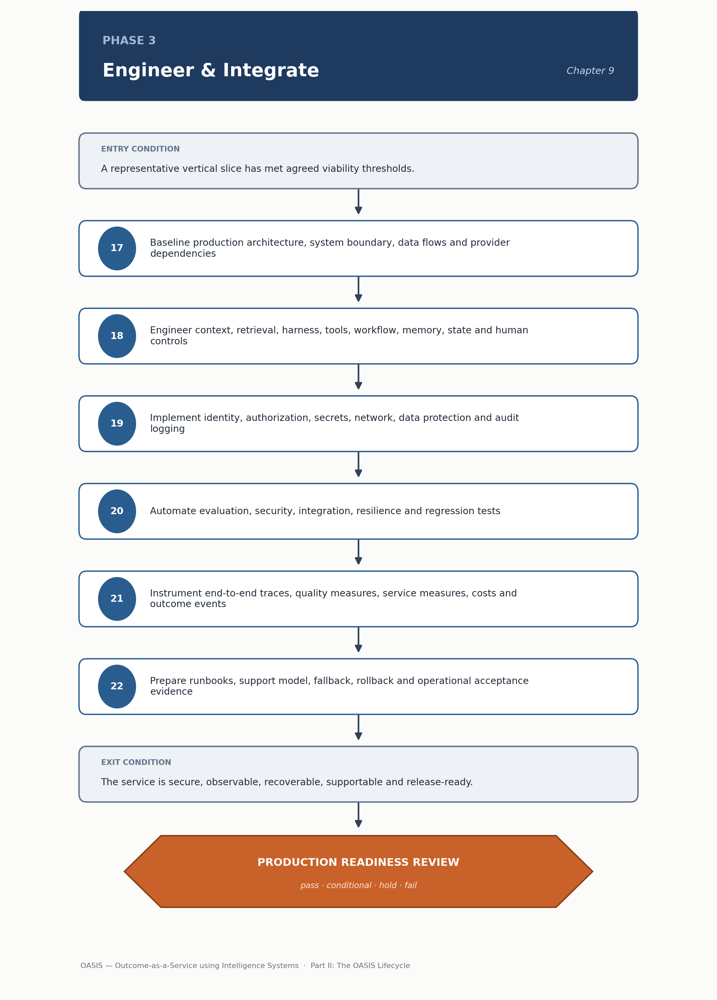

<!-- SPDX-License-Identifier: MIT -->

[← Previous: Chapter 08: Phase 2 — Discover & Validate](chapter-08-phase-2-discover-and-validate.md) · [Contents](../README.md) · [Next: Chapter 10: Phase 4 — Activate & Adopt →](chapter-10-phase-4-activate-and-adopt.md)

# Chapter 09: Phase 3 — Engineer & Integrate

# Phase 3 — Engineer & Integrate

> **CHAPTER PURPOSE** Convert a validated vertical slice into a secure, reliable, observable, integrated and supportable production intelligence service.

## Background and context

Phase 2 answers whether intelligence can work; Phase 3 commits to making it work reliably at production scale, under real load and adversarial pressure. A vertical slice proved the concept on curated cases with a small, forgiving group; a production service must survive live traffic's full variability, integrate cleanly with enterprise systems, degrade predictably when something upstream fails, and give the support team enough visibility to diagnose a 2 a.m. incident without the original build team.

This is the most engineering-dense phase in the lifecycle, and this chapter stays light on technical detail — that detail lives elsewhere in the handbook. The [Architecture](../architecture/oasis-reference-architecture.md) folder's reference architecture is the structural backbone this phase builds against; its ten [Architecture Principles](../architecture/oasis-reference-architecture.md#architecture-principles) — secure by design, observable by design, knowledge grounded, evidence gated, and the rest — are judgment calls a Phase 3 team makes constantly. The six [Engineering](../engineering/) articles are the working-level specification for each layer in the method below; treat this chapter as a map to those documents, not a substitute.

What Phase 3 hands [Phase 4 — Activate & Adopt](chapter-10-phase-4-activate-and-adopt.md) is not a live service but one proven ready to go live under controlled exposure — the gap between "engineered correctly" and "working for real users" is what the next phase exists to close.

*Figure 8. Phase 3 — Engineer & Integrate: method sequence and the Production Readiness Review gate.*

## Phase objective

Create a secure, reliable, observable, scalable and supportable production intelligence service.

Each adjective is a discipline to apply, not just assert. "Secure" means the [Security](../security/agentic-ai-threat-and-control-checklist.md) checklist's threat model has been worked through, not just acknowledged. "Observable" means the trace and version record in the [Monitoring](../monitoring/observability-and-telemetry-specification.md#2-trace-and-version-record-what-every-event-must-carry) specification is emitted from the first release. "Supportable" is what teams shortchange under deadline pressure — a system only its original engineers can operate has not finished Phase 3.

## Core questions

- Can it operate safely across enterprise systems?

- Can failures be detected, contained and recovered?

- Can every material change be tested and rolled back?

- Is support ownership clear?

These are the production-readiness bar as questions, ordered deliberately: safety and containment before change management, change management before ownership. A system that cannot answer the first two honestly should not be released, however clean its release process is. Detection without containment produces a well-documented outage; containment without recovery leaves the service stuck, needing manual unwinding.

## Method

17. Baseline the production architecture, system boundary, data flows, model and provider dependencies.

18. Engineer context, retrieval, harness, tools, workflow, memory, state, validation and human controls.

19. Implement identity, authorization, secrets, network, data protection, transaction limits and audit logging.

20. Automate evaluation, security, integration, resilience and regression tests in release pipelines.

21. Instrument end-to-end traces, quality measures, service measures, costs and outcome events.

22. Prepare runbooks, support model, fallback, rollback, recovery, capacity and operational acceptance evidence.

Step 18 is where most engineering effort concentrates: context and retrieval maps to [Context and Retrieval Engineering](../engineering/context-and-retrieval-engineering.md), harness and orchestration to [Harness and Orchestration Engineering](../engineering/harness-and-orchestration-engineering.md), tools to the [Tool and Integration Interface Specification](../engineering/tool-and-integration-interface-specification.md), and memory and state to [Memory and State Engineering](../engineering/memory-and-state-engineering.md). Step 19's controls should be checked directly against the [Security checklist's](../security/agentic-ai-threat-and-control-checklist.md#1-defense-in-depth-control-layers-ch-19-mapped-to-owasp-llm-top-10) defense-in-depth layers, not reconstructed from memory. Step 20's automated evaluation suite is the production-grade successor to Phase 2's evaluation dataset, covered in [Evaluation and Reliability Engineering](../engineering/evaluation-and-reliability-engineering.md). This is not scaffolding around the "real" work — it is the work; skipping steps 20-22 to hit a launch date defers their cost to the first production incident, at a much higher price.

## Primary artifacts

- Intelligence-System Blueprint

- Production Architecture

- Tool and Integration Contracts

- Threat and Control Model

- Automated Evaluation Suite

- Production Readiness Checklist

- Service Runbook

- Release and Rollback Plan

The Intelligence-System Blueprint is template 11 in [System and Governance Templates](../tools/03-system-and-governance-templates.md#11-intelligence-system-blueprint), structured around the reference architecture's [component-to-artifact map](../architecture/oasis-reference-architecture.md#2-component-to-artifact-map) so blueprint and diagram describe the same system. The Production Readiness Checklist is template 13 in [Readiness and Operations Templates](../tools/04-readiness-and-operations-templates.md#13-production-readiness-checklist); it is what the review runs against, pulling rows from the security checklist, applicable standards checklists, and the monitoring specification's release-manifest checklist.

> **DECISION OUTCOME** Production Readiness Review: release into controlled activation, remediate or hold.

## Entry and exit conditions

| **Entry condition**                                                  | **Exit condition**                                                             |
|------------------------------------------------------------------------|------------------------------------------------------------------------------------|
| A representative vertical slice has met agreed viability thresholds. | The service is secure, observable, recoverable, supportable and release-ready. |

Read the exit condition literally: "release-ready" is not "released." Phase 3 proves the service is safe to expose to real users under controlled conditions; it does not itself expose them. That handoff, and the progressive widening of exposure, belongs to Phase 4.

## Tailoring guidance

Small deployments may use managed platform defaults and one service owner. High-impact systems require explicit segregation, resilience targets, independent testing and trace retention.

Tailoring here tracks blast radius, not project size. A low-stakes internal tool on a managed platform can inherit most of its defaults under a single accountable owner. A system that can take irreversible action, touch regulated data, or affect customers directly needs independent testing and extended trace retention, so an incident review can reconstruct what happened months later.

---

[← Previous: Chapter 08: Phase 2 — Discover & Validate](chapter-08-phase-2-discover-and-validate.md) · [Contents](../README.md) · [Next: Chapter 10: Phase 4 — Activate & Adopt →](chapter-10-phase-4-activate-and-adopt.md)

© 2026 OASIS Methodology contributors. Licensed under the [MIT License](../LICENSE.md).
