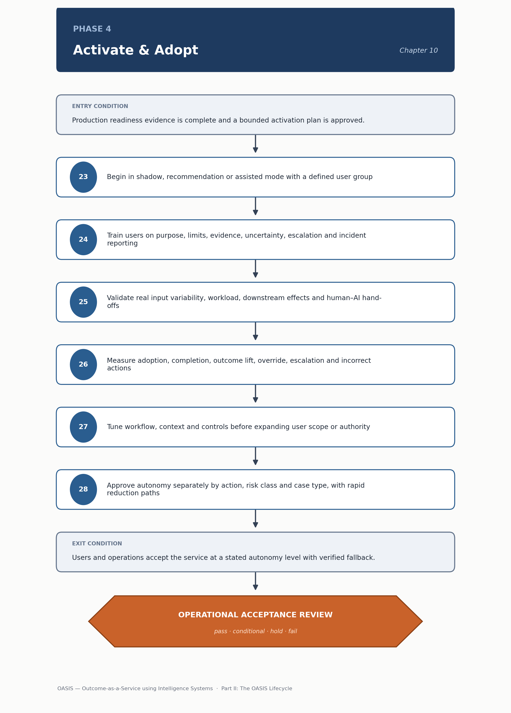

<!-- SPDX-License-Identifier: MIT -->

[← Previous: Chapter 09: Phase 3 — Engineer & Integrate](chapter-09-phase-3-engineer-and-integrate.md) · [Contents](../README.md) · [Next: Chapter 11: Phase 5 — Operate & Assure →](chapter-11-phase-5-operate-and-assure.md)

# Chapter 10: Phase 4 — Activate & Adopt

# Phase 4 — Activate & Adopt

> **CHAPTER PURPOSE** Introduce the service progressively into live operations, enable users, validate exceptions and earn higher operating authority through evidence.

*Figure 9. Phase 4 — Activate & Adopt: method sequence and the Operational Acceptance Review gate.*

## Background and context

Phase 3 proves a system is safe to release under controlled conditions; Phase 4 is where it actually meets real users, real workload variability and real consequences, and where the organization decides — deliberately, and in increments — how much it is willing to let the system do without a human in the loop. This is the phase where the gap between "engineered correctly" and "trusted in practice" gets closed, and it is closed by evidence accumulated in production, not by confidence accumulated in a demo.

The central idea running through this phase is progressive autonomy: a system does not move from off to fully autonomous in one release, it moves through a sequence of operating modes — shadow, assisted, supervised, and eventually some form of bounded autonomy — with each step up justified by evidence gathered at the step below, not by elapsed time or stakeholder enthusiasm. That progression is described in more architectural depth in [Architecture Perspective 2: Agent Architecture](../architecture/perspective-02-agent-architecture.md#1-agent-type-taxonomy), and it is tracked concretely through the [Autonomy Matrix](../tools/03-system-and-governance-templates.md#12-autonomy-matrix), which assigns evidence thresholds and escalation triggers per action and case class rather than granting authority to a system as a whole. A system that drafts customer replies and also issues refunds needs two separate autonomy rows, because the evidence required to trust the first has nothing to do with the evidence required to trust the second.

Phase 4 hands [Phase 5 — Operate & Assure](chapter-11-phase-5-operate-and-assure.md) a service that has demonstrated it works for real users at a stated, evidenced level of authority — with a verified fallback path and a trained user base — so that ongoing operations can start from a stable baseline rather than still be discovering basic workflow-fit problems in production.

## Phase objective

Introduce the service into live operations, enable users and progressively increase authority only when evidence supports it.

The word "only" in that sentence is not decorative. The single most common failure mode in this phase is authority creeping upward informally — a supervisor who stops reviewing every case because the system has "seemed fine," a team that quietly widens a user cohort because the pilot group is happy — without anyone deliberately making that decision against evidence. The Autonomy Matrix exists precisely to make each authority increase a visible, evidenced, reversible decision rather than a drift.

## Core questions

- Can users complete real work successfully?

- Do exception and fallback paths work?

- Is trust calibrated rather than merely high?

- Which case classes are ready for the next autonomy level?

The third question deserves particular attention because it is easy to misread "high trust" as success. A user who trusts the system too much — who stops checking its output because it has been right often enough — is a control failure waiting to surface, not a validation of the system's quality. Calibrated trust means users know which kinds of cases the system handles well and which it doesn't, and behave accordingly; that calibration has to be built deliberately through training and interface design, not assumed to develop on its own.

## Method

23. Begin in shadow, recommendation or assisted mode with a defined user group and monitoring window.

24. Train users on purpose, limits, evidence, uncertainty, approvals, overrides, escalation and incident reporting.

25. Validate real input variability, workload, downstream effects and human–AI hand-offs.

26. Measure adoption, completion, outcome lift, override, escalation, complaints, incorrect actions and time saved.

27. Tune workflow, context, controls and training before expanding user scope or authority.

28. Approve autonomy separately by action, risk class and case type; provide rapid reduction or suspension paths.

Step 23's starting point matters: shadow or assisted mode lets the system's behavior be observed against real traffic before any of its output actually reaches a decision, which is the only way to gather production-representative evidence without production-level risk. Step 24's training list is worth reading in full, because "train users on the system" is usually interpreted narrowly as interface training, when the list here is really about judgment — teaching users what the system is uncertain about, and what to do when it is. Step 26's metrics are deliberately mixed: adoption and time-saved measure whether the system is useful, while override, escalation and incorrect-action rates measure whether it is trustworthy, and a Phase 4 review that reports only the first set without the second is not giving an honest picture. Step 28's requirement to approve autonomy separately by action and risk class is the operational expression of the Autonomy Matrix discipline described above, and the rapid-reduction path it also requires is not an afterthought — a system with no fast way back down cannot be safely corrected once trust turns out to have been miscalibrated.

## Primary artifacts

- Activation Plan

- User Enablement Pack

- Autonomy Matrix

- Operational Acceptance Tests

- Pilot Scorecard

- Feedback and Exception Log

- Operational Acceptance Record

The Autonomy Matrix is template 12 in [System and Governance Templates](../tools/03-system-and-governance-templates.md#12-autonomy-matrix); the Operational Acceptance Tests correspond to the checklist in [Readiness and Operations Templates](../tools/04-readiness-and-operations-templates.md#14-operational-acceptance-checklist), which is a deliberately distinct gate from the Production Readiness Checklist used to exit Phase 3 — readiness confirms the system is safe to expose to live users, acceptance confirms it is actually working for them once it is, and collapsing the two hides the specific failure mode of a technically sound system that nonetheless underperforms in the hands of real users.

> **DECISION OUTCOME** Operational Acceptance Review: accept, correct, widen, reduce or suspend.

## Entry and exit conditions

| **Entry condition**                                                                  | **Exit condition**                                                                         |
|------------------------------------------------------------------------------------------|----------------------------------------------------------------------------------------------|
| Production readiness evidence is complete and a bounded activation plan is approved. | Users and operations accept the service at a stated autonomy level with verified fallback. |

The exit condition names two distinct constituencies — users and operations — deliberately. A service users like but operations cannot support sustainably has not exited Phase 4 cleanly, and neither has a service operations can run but users route around because it doesn't fit how they actually work.

## Tailoring guidance

Low-risk productivity tools may move quickly from assist to routine use. Transactional, customer-facing or regulated systems should widen by cohort, case class and authority threshold.

The pace of widening should track consequence, not enthusiasm. A well-received internal productivity assistant with no external exposure can reasonably move fast, because a mistake is cheap to catch and correct. A system that takes action on customer accounts, moves money, or operates in a regulated domain should widen deliberately — cohort by cohort, case class by case class, authority threshold by authority threshold — precisely because the Autonomy Matrix's evidence requirement is what stands between a considered expansion and an informal one.

---

[← Previous: Chapter 09: Phase 3 — Engineer & Integrate](chapter-09-phase-3-engineer-and-integrate.md) · [Contents](../README.md) · [Next: Chapter 11: Phase 5 — Operate & Assure →](chapter-11-phase-5-operate-and-assure.md)

© 2026 OASIS Methodology contributors. Licensed under the [MIT License](../LICENSE.md).
