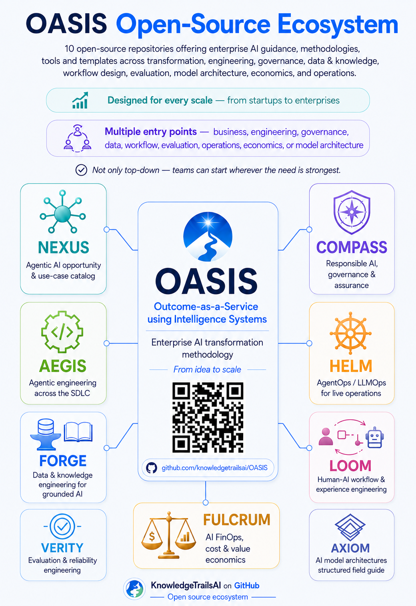

<!-- SPDX-License-Identifier: CC-BY-SA-4.0 -->

# OASIS Methodology Handbook

**Outcome-as-a-Service using Intelligence Systems** — the master methodology for enterprise AI transformation: what to do, in what order, and why.

## OASIS is the master methodology. These are its companion repositories.

OASIS is not an implementation guide for any one practice area. That depth lives in nine companion repositories instead, each maintained independently and scoped to one (or a closely related pair of) Part III engineering chapters. The full mapping, ownership, and depth notes are in the [Companion Repository Index](References/companion-repository-index.md).

| Repository | Chapter(s) | What it covers |
|---|---|---|
| [Ageis](https://github.com/knowledgetrailsai/Ageis) | Ch. 14 | Agentic coding delivery — the "Intelligence and Agent Engineering" discipline applied to software delivery end to end |
| [Forge](https://github.com/knowledgetrailsai/Forge) | Ch. 15 | Data and knowledge engineering — retrieval architectures, embeddings, grounding |
| [Loom](https://github.com/knowledgetrailsai/Loom) | Ch. 16 | Human–AI workflow and experience engineering — progressive autonomy, escalation, workflow blueprints |
| [Helm](https://github.com/knowledgetrailsai/Helm) | Ch. 17 (light), 18 (light), 19, 21, 26 | Deployment, operations, and AgentOps — observability, release management, incident response, security containment |
| [Verity](https://github.com/knowledgetrailsai/Verity) | Ch. 18 | Evaluation and reliability engineering — the fifteen-dimension evaluation methodology, statistical rigor, failure taxonomy |
| [Compass](https://github.com/knowledgetrailsai/responsible-ai) | Ch. 19, 20 | Security, responsible AI, governance, and regulatory compliance across jurisdictions |
| [Fulcrum](https://github.com/knowledgetrailsai/oasis-fulcrum) | Ch. 22 | Economics, FinOps, and sustainability — cost and value tracking for AI systems |
| [Nexus](https://github.com/knowledgetrailsai/Nexus) | Cross-cutting (feeds Ch. 5) | The opportunity catalog — which use case, in which domain and function, before it enters the OASIS lifecycle |
| [Axiom](https://github.com/knowledgetrailsai/Axiom) | Background (underpins Ch. 14) | AI model architecture reference — Transformers, MoE, SSMs, and related families — not itself a chapter companion |

**Known gap:** Chapter 17 (Enterprise Integration and Tool Engineering) has no dedicated companion at Forge/Loom/Verity's depth yet — see the index for what light coverage exists in Helm.

---

This is a simple, Markdown-only GitHub package. All handbook pages are stored in this single folder and linked using relative Markdown links. Open this `README.md` file to navigate the handbook. See [CHANGELOG.md](CHANGELOG.md) for what's changed and when, including the review cadence expected for the Standards and References material.

## Start here, by role

**Executive sponsor or business owner.** You want the case for committing budget, and a way to check whether it's working. Begin with [Chapter 01: OASIS Executive Overview](methodology/chapter-01-oasis-executive-overview.md) and [Chapter 03: Enterprise AI Transformation Direction](methodology/chapter-03-enterprise-ai-transformation-direction.md). Then use the [AI Engineering Maturity Model](assessments/oasis-ai-engineering-maturity-model.md) to see where the organization stands today. [CHANGELOG.md](CHANGELOG.md) shows what changed most recently and when it will next be reviewed.

**Delivery or engagement lead.** You're running an initiative through the six phases. Begin with [Chapter 04: Multiple Entry Paths and Configurable Depth](methodology/chapter-04-multiple-entry-paths-and-configurable-depth.md) to pick the right depth. Then work through [Part II: The OASIS Lifecycle](methodology/part-ii-the-oasis-lifecycle.md) (Chapters 7–13); each phase has its own diagram. [Chapter 32](methodology/chapter-32-templates-checklists-and-tools.md) names the twenty artifacts you'll actually produce, and their fillable versions are in [Tools](tools/01-outcome-and-portfolio-templates.md). The [Master Glossary and Roles Roster](references/master-glossary-and-roles-roster.md) resolves any unfamiliar term or role along the way.

**Architect or engineer building the system.** Begin with [Chapter 14: Intelligence and Agent Engineering](methodology/chapter-14-intelligence-and-agent-engineering.md) for the system equation. Then read the six companion articles in the Engineering section below — Model, Context, Tool, Harness, Memory, and Evaluation Engineering. The [OASIS Reference Architecture](architecture/oasis-reference-architecture.md) and its nine enterprise perspectives show how the pieces fit together as components. The [Companion Repository Index](References/companion-repository-index.md) points to the implementation-depth repository for each Part III chapter.

**Security, governance, risk or compliance reviewer.** Begin with [Chapter 19: Security and Responsible AI Engineering](methodology/chapter-19-security-and-responsible-ai-engineering.md) and [Chapter 20: Governance, Compliance and Regulatory Engineering](methodology/chapter-20-governance-compliance-and-regulatory-engineering.md). Then read the [Security: Agentic AI Threat Model and Control Checklist](security/agentic-ai-threat-and-control-checklist.md) and the four framework-specific checklists in [Standards](standards/iso-42001-alignment-checklist.md), each indexed from the [Regulatory and Standards Framework Alignment Index](references/regulatory-framework-alignment-index.md).

**Operations or support, running a live system.** Begin with [Chapter 21: Deployment, Operations and AgentOps](methodology/chapter-21-deployment-operations-and-agentops.md). Then read the [Monitoring: Observability and Telemetry Specification](monitoring/observability-and-telemetry-specification.md) and the [Service Runbook](tools/04-readiness-and-operations-templates.md#16-service-runbook) template. [Chapter 26: OASIS Measurement Framework](methodology/chapter-26-oasis-measurement-framework.md) defines what the [Outcome Scorecard](tools/04-readiness-and-operations-templates.md#15-outcome-scorecard) should track once the system is live.

## Handbook contents

- [Handbook Introduction](00-handbook-introduction.md)

### [Part I: Transformation Foundations](methodology/part-i-transformation-foundations.md)

- [Chapter 01: OASIS Executive Overview](methodology/chapter-01-oasis-executive-overview.md)
- [Chapter 02: Methodology Foundations and Design Principles](methodology/chapter-02-methodology-foundations-and-design-principles.md)
- [Chapter 03: Enterprise AI Transformation Direction](methodology/chapter-03-enterprise-ai-transformation-direction.md)
- [Chapter 04: Multiple Entry Paths and Configurable Depth](methodology/chapter-04-multiple-entry-paths-and-configurable-depth.md)
- [Chapter 05: Opportunity Portfolio and Transformation Horizons](methodology/chapter-05-opportunity-portfolio-and-transformation-horizons.md)
- [Chapter 06: OASIS Operating Model and Decision Rights](methodology/chapter-06-oasis-operating-model-and-decision-rights.md)

### [Part II: The OASIS Lifecycle](methodology/part-ii-the-oasis-lifecycle.md)

- [Chapter 07: Phase 1 — Engage & Align](methodology/chapter-07-phase-1-engage-and-align.md) ([diagram](diagrams/lifecycle-phases/phase-1-engage-and-align.png))
- [Chapter 08: Phase 2 — Discover & Validate](methodology/chapter-08-phase-2-discover-and-validate.md) ([diagram](diagrams/lifecycle-phases/phase-2-discover-and-validate.png))
- [Chapter 09: Phase 3 — Engineer & Integrate](methodology/chapter-09-phase-3-engineer-and-integrate.md) ([diagram](diagrams/lifecycle-phases/phase-3-engineer-and-integrate.png))
- [Chapter 10: Phase 4 — Activate & Adopt](methodology/chapter-10-phase-4-activate-and-adopt.md) ([diagram](diagrams/lifecycle-phases/phase-4-activate-and-adopt.png))
- [Chapter 11: Phase 5 — Operate & Assure](methodology/chapter-11-phase-5-operate-and-assure.md) ([diagram](diagrams/lifecycle-phases/phase-5-operate-and-assure.png))
- [Chapter 12: Phase 6 — Optimize & Scale](methodology/chapter-12-phase-6-optimize-and-scale.md) ([diagram](diagrams/lifecycle-phases/phase-6-optimize-and-scale.png))
- [Chapter 13: Decision Gates and Evidence Model](methodology/chapter-13-decision-gates-and-evidence-model.md) ([diagram](diagrams/chapter-figures/figure-3-decision-gates.png))

### [Part III: Intelligence-System Engineering and Assurance](methodology/part-iii-intelligence-system-engineering-and-assurance.md)

- [Chapter 14: Intelligence and Agent Engineering](methodology/chapter-14-intelligence-and-agent-engineering.md) ([diagram](diagrams/chapter-figures/figure-4-system-equation.png))
- [Chapter 15: Data and Knowledge Engineering](methodology/chapter-15-data-and-knowledge-engineering.md)
- [Chapter 16: Human–AI Workflow and Experience Engineering](methodology/chapter-16-human-ai-workflow-and-experience-engineering.md)
- [Chapter 17: Enterprise Integration and Tool Engineering](methodology/chapter-17-enterprise-integration-and-tool-engineering.md)
- [Chapter 18: Evaluation and Reliability Engineering](methodology/chapter-18-evaluation-and-reliability-engineering.md)
- [Chapter 19: Security and Responsible AI Engineering](methodology/chapter-19-security-and-responsible-ai-engineering.md)
- [Chapter 20: Governance, Compliance and Regulatory Engineering](methodology/chapter-20-governance-compliance-and-regulatory-engineering.md)
- [Chapter 21: Deployment, Operations and AgentOps](methodology/chapter-21-deployment-operations-and-agentops.md)
- [Chapter 22: Economics, FinOps and Sustainability](methodology/chapter-22-economics-finops-and-sustainability.md)

### [Part IV: Delivery and Enterprise Enablement](methodology/part-iv-delivery-and-enterprise-enablement.md)

- [Chapter 23: Forward Deployed Outcome Engineering](methodology/chapter-23-forward-deployed-outcome-engineering.md)
- [Chapter 24: Roles, Teams and Governance Forums](methodology/chapter-24-roles-teams-and-governance-forums.md)
- [Chapter 25: Enterprise Intelligence Platform](methodology/chapter-25-enterprise-intelligence-platform.md)

### [Part V: Measurement, Scaling and Institutionalization](methodology/part-v-measurement-scaling-and-institutionalization.md)

- [Chapter 26: OASIS Measurement Framework](methodology/chapter-26-oasis-measurement-framework.md)
- [Chapter 27: Delivery Cadence and Management Practices](methodology/chapter-27-delivery-cadence-and-management-practices.md)
- [Chapter 28: Scaling and Productization](methodology/chapter-28-scaling-and-productization.md)
- [Chapter 29: OASIS Adoption Roadmap](methodology/chapter-29-oasis-adoption-roadmap.md)
- [Chapter 30: Tailoring OASIS](methodology/chapter-30-tailoring-oasis.md)
- [Chapter 31: Illustrative Use Cases](methodology/chapter-31-illustrative-use-cases.md)
- [Chapter 32: Templates, Checklists and Tools](methodology/chapter-32-templates-checklists-and-tools.md) ([diagram](diagrams/chapter-figures/figure-12-templates-map.png))
- [Chapter 33: Appendices and Reference Material](methodology/chapter-33-appendices-and-reference-material.md)

## Standards and reference material

- [Regulatory and Standards Framework Alignment Index](references/regulatory-framework-alignment-index.md)
- [Standard: ISO/IEC 42001 Alignment Checklist](standards/iso-42001-alignment-checklist.md)
- [Standard: NIST AI RMF Alignment Checklist](standards/nist-ai-rmf-alignment-checklist.md)
- [Standard: EU AI Act Alignment Checklist](standards/eu-ai-act-alignment-checklist.md)
- [Standard: DPDP Act Alignment Checklist](standards/dpdp-act-alignment-checklist.md)
- Additional relevant standards and frameworks are listed in the alignment index.
- [Master Glossary and Roles Roster](references/master-glossary-and-roles-roster.md) (terms and roles across the whole repository, plus a default RACI)
- [Companion Repository Index](References/companion-repository-index.md) (the implementation repository for each Part III chapter, and how far each one currently goes)

## Assessments

- [AI Engineering Maturity Model](assessments/oasis-ai-engineering-maturity-model.md) (nine dimensions, five levels, weakest-link scoring)
- [Maturity Scorecard Template](assessments/oasis-maturity-scorecard-template.md) (fillable, per assessment cycle)

## Architecture, Engineering and Monitoring Reference

- [Architecture: OASIS Intelligence-System Reference Architecture](architecture/oasis-reference-architecture.md) (system diagram, design principles, enterprise perspectives)
  - [Architecture Principles](architecture/oasis-reference-architecture.md#architecture-principles)
  - Enterprise architecture perspectives:
    - [1. Business and Capability Architecture](architecture/perspective-01-business-and-capability-architecture.md)
    - [2. Agent Architecture](architecture/perspective-02-agent-architecture.md)
    - [3. Process Architecture](architecture/perspective-03-process-architecture.md)
    - [4. Information and Knowledge Architecture](architecture/perspective-04-information-and-knowledge-architecture.md)
    - [5. Inference Architecture](architecture/perspective-05-inference-architecture.md)
    - [6. Integration Architecture](architecture/perspective-06-integration-architecture.md)
    - [7. Deployment Architecture](architecture/perspective-07-deployment-architecture.md)
    - [8. Security and Trust Architecture](architecture/perspective-08-security-and-trust-architecture.md)
    - [9. Operations and Observability Architecture](architecture/perspective-09-operations-and-observability-architecture.md)
- Engineering (Chapter 14 companion articles, in build order):
  - [Model Engineering](engineering/model-engineering.md)
  - [Context and Retrieval Engineering](engineering/context-and-retrieval-engineering.md)
  - [Tool and Integration Interface Specification](engineering/tool-and-integration-interface-specification.md)
  - [Harness and Orchestration Engineering](engineering/harness-and-orchestration-engineering.md)
  - [Memory and State Engineering](engineering/memory-and-state-engineering.md)
  - [Evaluation and Reliability Engineering](engineering/evaluation-and-reliability-engineering.md)
- [Monitoring: Observability and Telemetry Specification](monitoring/observability-and-telemetry-specification.md)

## Security reference

- [Security: Agentic AI Threat Model and Control Checklist](security/agentic-ai-threat-and-control-checklist.md)

## Tools: fillable templates

Fillable versions of all 20 artifacts named in [Chapter 32](methodology/chapter-32-templates-checklists-and-tools.md), grouped by lifecycle stage:

- [Outcome and Portfolio Templates](tools/01-outcome-and-portfolio-templates.md) — Opportunity Assessment, Outcome Charter, Outcome Contract, Outcome Metric Tree, Value and Risk Case
- [Workflow and Intelligence Templates](tools/02-workflow-and-intelligence-templates.md) — Process and Decision Map, Human–AI Workflow Blueprint, Data and Knowledge Readiness Assessment, Evaluation Strategy and Dataset, Failure Taxonomy
- [System and Governance Templates](tools/03-system-and-governance-templates.md) — Intelligence-System Blueprint, Autonomy Matrix, Responsibility Assignment Matrix, Decision-Gate Record
- [Readiness and Operations Templates](tools/04-readiness-and-operations-templates.md) — Production Readiness Checklist, Operational Acceptance Checklist, Outcome Scorecard, Service Runbook
- [Risk and Scale Templates](tools/05-risk-and-scale-templates.md) — Risk and Control Register, Scale and Productization Assessment

## License

Licensed under [CC BY-SA 4.0](https://github.com/knowledgetrailsai/OASIS/blob/main/LICENSE.md). Reuse and adaptation are welcome with credit to KnowledgeTrails-OASIS, a link to the license, an indication of changes, and release of adaptations under the same license.

## About Us

**Shripadraj Mujumdar** is an Agentic AI & Automation Strategist, Advisor, and Responsible AI Expert with 28+ years of experience in enterprise architecture and AI-driven transformation, including deep hands-on work in Agentic AI, Generative AI, and enterprise data and knowledge platforms. His practice spans designing multi-agent systems, knowledge-graph and RAG architectures, accelerated delivery capabilities, and Responsible AI governance frameworks aligned to global regulatory standards. This methodology ecosystem distills that practitioner experience — architecture, delivery, evaluation, governance, and economics — into a single, reusable body of work.
