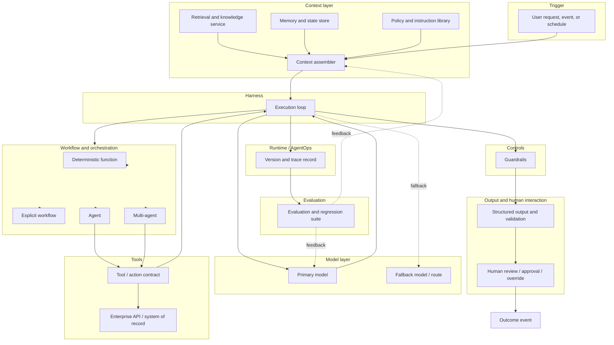
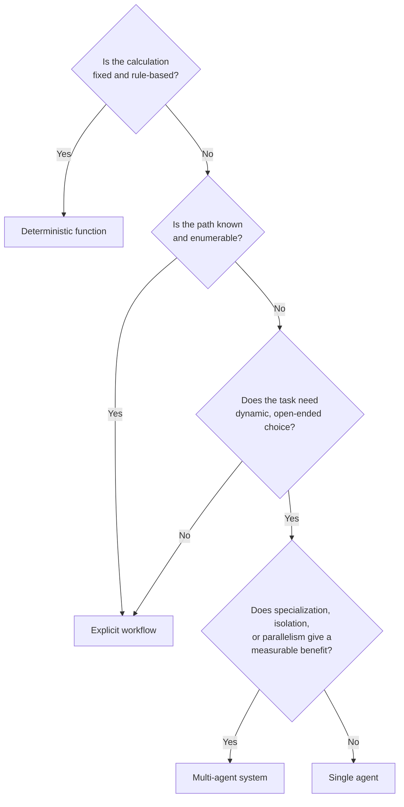

<!-- SPDX-License-Identifier: MIT -->

---

[← Back to Contents](../README.md) · [Chapter 14: Intelligence and Agent Engineering](../methodology/chapter-14-intelligence-and-agent-engineering.md) · [Engineering: Tool and Integration Interface Specification →](../engineering/tool-and-integration-interface-specification.md)

# Architecture: OASIS Intelligence-System Reference Architecture

> **PURPOSE** Give a first-pass, technology-neutral reference architecture for the intelligence system described conceptually in [Chapter 14](../methodology/chapter-14-intelligence-and-agent-engineering.md), so a delivery team has a concrete component diagram to start from instead of reconstructing one from narrative each engagement. This is a starting point for the [Intelligence-System Blueprint](../methodology/chapter-32-templates-checklists-and-tools.md#11-intelligence-system-blueprint) — tailor components, not the layering discipline, to the engagement.

**Primary OASIS source:** [Chapter 14 — Intelligence and Agent Engineering](../methodology/chapter-14-intelligence-and-agent-engineering.md) (system equation and sections 1–12), cross-referenced with [Chapter 17 — Enterprise Integration and Tool Engineering](../methodology/chapter-17-enterprise-integration-and-tool-engineering.md) and [Chapter 19 — Security and Responsible AI Engineering](../methodology/chapter-19-security-and-responsible-ai-engineering.md) (defense-in-depth layers).

**Companion repositories:** this reference architecture sits above every Part III companion repository — see the [Companion Repository Index](../References/companion-repository-index.md) for the full chapter-to-repository map, and the nine [enterprise architecture perspectives](#6-enterprise-architecture-perspectives) below for the specific companion tied to each perspective.

## Background and context

Chapter 14 works at the level of a *methodology*. It tells a team what decisions to make — how to pick a model, when to use an agent instead of a deterministic function, what a tool contract must contain — but it does not draw a picture. That is deliberate: the right picture differs by engagement, and Chapter 14 has to stay neutral about technology and vendors.

That is fine for a methodology chapter, but it leaves a gap. A team starting a build still needs something to put on a whiteboard on day one. Re-deriving a component diagram from eleven pages of narrative every time a new engagement starts wastes effort. This document is that starting diagram: a concrete first draft a team can copy, mark up, and discard the parts that don't apply. It is not an authoritative architecture every OASIS system must match exactly.

Three things to keep in mind while reading it.

First, the diagram in Section 1 is a **capability map, not a deployment topology**. Each box is a responsibility the system must fulfil — assemble context, enforce a limit, validate an output — not a literal microservice, container, or team boundary. A small system might implement the Context assembler and the Harness as one function in one codebase. A large multi-tenant platform might implement each box as its own service. The architecture describes which responsibilities exist and how they hand off to each other, not how finely the system is deployed.

Second, the diagram follows the same order Chapter 14 uses for its sections: specification → model → data/retrieval → context → tools → harness → workflow → memory → human interaction/validation → guardrails → evaluation → runtime. That lets you read Section 2's component-to-artifact map top-to-bottom against both the diagram and the chapter at once.

Third, this is a **reference**, not a mandate. Section 5 explains which components a simpler system may omit — and that decision is governed by Chapter 30's tailoring framework, not by this document.

If you are new to reading Mermaid flowcharts: boxes are components, arrows show the direction data or control flows, dashed arrows (`-.->`) indicate a fallback or feedback path rather than the primary flow, and boxes grouped inside a labelled `subgraph` belong to the same layer of the system equation below. GitHub, most IDEs, and most Markdown viewers render the diagrams inline automatically; if your viewer does not render Mermaid, the same information is repeated as prose and tables in Sections 2–4 so the document remains usable either way.

## Architecture Principles

Chapter 14 governs engineering *decisions*. These principles govern the architecture *judgment calls* that come up repeatedly across every layer in Sections 2–5 and across the nine perspective articles in Section 6. If a specific decision conflicts with a principle here, treat that as a flag for architecture review — not as license to ignore either one. Each principle names the chapter it comes from and the mechanism that makes it checkable, not just aspirational.

| # | Principle | What it requires | Why it matters | Primary source | How it is checked |
|---|---|---|---|---|---|
| 1 | **Secure by design** | Defense-in-depth controls (Ch.19) are designed into each layer of Section 1's diagram at the point the layer is built, not added at the perimeter after the fact. | A control bolted on after deployment covers the attack surface someone thought of; a control designed into the layer covers the attack surface the layer actually has. | Ch.19 | [Security: Threat and Control Checklist](../security/agentic-ai-threat-and-control-checklist.md) — every layer has a named control before go-live |
| 2 | **Human accountable** | Every autonomous action traces to a named accountable human, even when no human is in the execution loop for that action. Autonomy removes a human from the *loop*; it never removes a human from *accountability*. | Autonomy without a named accountable owner is ungovernable the first time an action goes wrong and no one can say who was responsible for allowing it. | Ch.16, Ch.20 | [Responsibility Assignment Matrix](../methodology/chapter-32-templates-checklists-and-tools.md#19-responsibility-assignment-matrix); [Autonomy Matrix](../methodology/chapter-32-templates-checklists-and-tools.md#12-autonomy-matrix) |
| 3 | **Model independent** | No component outside the Model layer (Section 1) hard-codes assumptions specific to one model or vendor. Prompts, evaluations, and harness logic are written against the system's own contracts, not a specific provider's quirks. | Model quality, price and availability all shift faster than the rest of the architecture; a system wired to one model inherits every one of that model's outages, deprecations and price changes as its own. | Ch.14 §2 | [Model Engineering: benchmark record and routing design](../engineering/model-engineering.md) |
| 4 | **Observable by design** | Every decision or action carries the trace record defined in the Monitoring specification — which model, prompt, context, index, tool, workflow and control version produced it — from the first release, not retrofitted after the first incident. | "What changed?" is the first question of every incident review; a system that cannot answer it turns every incident into an investigation instead of a lookup. | Ch.21, Ch.14 §12 | [Monitoring: Observability and Telemetry Specification §2](../monitoring/observability-and-telemetry-specification.md#2-trace-and-version-record-what-every-event-must-carry) |
| 5 | **Knowledge grounded** | Every substantive claim, decision or generated artifact is traceable to authorized, attributed, fresh evidence — not to the model's unsupported assertion. | An ungrounded but fluent answer is the specific failure mode that erodes trust fastest, because it is indistinguishable from a correct one until someone checks. | Ch.14 §3–4, Ch.15 | [Context and Retrieval Engineering §3 — Context quality checklist](../engineering/context-and-retrieval-engineering.md#3-context-quality-checklist) |
| 6 | **Evidence gated** | Progression through the lifecycle (and through an autonomy level within a deployed system) is gated on evidence meeting a defined bar, not on calendar time elapsed or stakeholder confidence alone. | Calendar-based and confidence-based gating both let systems advance on optimism; evidence gating is the only form of gating that catches a system that is not actually ready. | Ch.13 | [Decision-Gate Record](../methodology/chapter-32-templates-checklists-and-tools.md#20-decision-gate-record) |
| 7 | **Progressively autonomous** | Autonomy is granted incrementally against demonstrated reliability at the current level, with an explicit, reversible path back to a lower autonomy level if reliability regresses. | A system that jumps straight to high autonomy has no evidence base for that level of trust, and a system with no path back down cannot be safely corrected once a problem appears. | Ch.10, Ch.16 | Autonomy Matrix (see Responsibility Assignment Matrix template) |
| 8 | **Outcome oriented** | Every architectural component exists to serve a named, measured business outcome (per the Outcome Metric Tree), not because the technology is available or fashionable. | Architecture built around a technology rather than an outcome is the leading cause of systems that ship, work as specified, and still fail to move any business metric. | Ch.1, Ch.3, Ch.26 | [Outcome Metric Tree](../methodology/chapter-32-templates-checklists-and-tools.md#4-outcome-metric-tree) |
| 9 | **Composable and reusable** | Components (context sources, tool contracts, evaluation suites, guardrail policies) are built as shared platform assets with defined interfaces, so the second and third use case reuse them rather than rebuilding equivalents. | Every component rebuilt per use case multiplies both delivery cost and the number of independently-drifting implementations of the same control. | Ch.25, Ch.28 | [Scale and Productization Assessment](../methodology/chapter-32-templates-checklists-and-tools.md#18-scale-and-productization-assessment) |
| 10 | **Jurisdiction neutral, compliance-ready** | The architecture does not assume a single regulatory regime; obligations that vary by jurisdiction (data residency, disclosure, human-review rights) are represented as configurable policy, not hard-coded logic. | A system architected for one jurisdiction's rules is expensive to re-architect for the next one; a system that treats jurisdiction as configuration only needs new configuration. | Ch.20, [Regulatory and Standards Framework Alignment Index](../references/regulatory-framework-alignment-index.md) | [Standards](../standards/) checklists per applicable framework |

These ten are a floor, not a ceiling. An engagement with an added constraint — a regulated sector's own architecture principles, for example — should add rows rather than treat this list as complete. Section 6 below applies these principles at each of the nine enterprise-architecture perspectives.

## 1. System equation, as a diagram

Chapter 14 states: **AI system = Model + Context + Harness + Tools + Workflow + Memory/State + Controls + Evaluation + Runtime.** The diagram below arranges those nine components as a request/response flow rather than a flat list.

## 2. Component-to-artifact map

| # | Component | OASIS engineering section | Design decision it must answer | Primary artifact |
|---|---|---|---|---|
| 1 | Intelligence-system specification | Ch. 14 §1 | What must the system understand, decide, generate or execute — and what is explicitly prohibited? | [Intelligence-System Blueprint](../methodology/chapter-32-templates-checklists-and-tools.md#11-intelligence-system-blueprint) |
| 2 | Model layer (primary + fallback) | Ch. 14 §2 | Which model/route meets quality, cost and latency thresholds for this task? | Model Strategy and Benchmark |
| 3 | Data, retrieval and knowledge foundations | Ch. 14 §3 | What is the smallest sufficient, authoritative evidence set? | [Data and Knowledge Readiness Assessment](../methodology/chapter-32-templates-checklists-and-tools.md#8-data-and-knowledge-readiness-assessment) |
| 4 | Context assembler | Ch. 14 §4 | What does the model see at this decision point, and is it authorized, attributed, fresh and bounded? | Context Architecture |
| 5 | Harness (execution loop) | Ch. 14 §6 | How does the task progress, recover and terminate? | Harness and Workflow Design |
| 6 | Workflow/orchestration selector | Ch. 14 §7 | Deterministic function, explicit workflow, single agent, or multi-agent — and why? | Harness and Workflow Design |
| 7 | Tools / action contracts | Ch. 14 §5; Ch. 17 | What can the system access or execute, under what controls? | [Tool and Integration Interface Specification](../engineering/tool-and-integration-interface-specification.md) |
| 8 | Memory and state store | Ch. 14 §8 | What persists, for whom, for how long, and with what correction rights? | Memory and State Policy |
| 9 | Guardrails / controls | Ch. 14 §10; Ch. 19 | Which layer enforces which limit, and what happens on breach? | Risk and Control Register |
| 10 | Output validation & human interaction | Ch. 14 §9 | What schema, evidence and approval does a human or downstream system require? | [Human–AI Workflow Blueprint](../methodology/chapter-32-templates-checklists-and-tools.md#7-human-ai-workflow-blueprint) |
| 11 | Evaluation & regression suite | Ch. 14 §11 | What constitutes acceptable behavior and change? | [Evaluation Strategy and Dataset](../methodology/chapter-32-templates-checklists-and-tools.md#9-evaluation-strategy-and-dataset) |
| 12 | Runtime / AgentOps trace | Ch. 14 §12; Ch. 21 | Which version of every component produced this outcome? | [Monitoring: Observability and Telemetry Specification](../monitoring/observability-and-telemetry-specification.md) |

## 3. Defense-in-depth overlay

Chapter 19's eight control layers map directly onto this architecture rather than sitting beside it as a separate concern. Apply controls at the point they are drawn, not only at the perimeter:

| Ch. 19 layer | Where it sits in this architecture |
|---|---|
| Input | Trigger → Context assembler boundary |
| Context | Inside the Context assembler (source trust, authorization filters, injection isolation) |
| Model | Model layer (instructions, safety behavior, restricted capabilities) |
| Tool | Tool/action contracts (allow lists, schemas, least privilege, spend limits) |
| Workflow | Workflow/orchestration selector (approvals, segregation of duties, checkpoints) |
| Output | Output validation stage (grounding, policy, privacy, schema checks) |
| Runtime | Harness execution loop (sandboxing, budgets, containment) |
| Operations | Runtime/AgentOps trace (monitoring, incident response, kill switch, audit) |

## 4. Selecting the orchestration pattern (Ch. 14 §7 decision rule)

Default to the simplest option that satisfies the task. Multi-agent is justified by measured benefit, not by default sophistication — an unjustified multi-agent design is itself an architecture-review finding.

## 5. Tailoring this architecture

Per [Chapter 30 — Tailoring OASIS](../methodology/chapter-30-tailoring-oasis.md), not every engagement needs every component populated at full depth. A deterministic-function-only system (bottom path in §4) may legitimately omit the Model, Memory and Multi-agent boxes — but should still complete the Controls, Output validation and Runtime trace components, since those apply regardless of how much of the system is "AI."

## 6. Enterprise architecture perspectives

Sections 1–5 describe **one intelligence system** as a component diagram. That's the right level for a single build team on a single engagement. It's the wrong level for an enterprise running many intelligence systems at once. A CIO/CTO office, an enterprise architecture function, or a platform team needs to reason about agentic capability the way it reasons about any other enterprise domain — by perspective, not by component.

The nine perspectives below give that enterprise-architecture view. Each is a thin layer over material that mostly already exists elsewhere in this repository — Engineering, Security, Monitoring, Standards. What these articles add is the enterprise-wide framing (taxonomy, ownership, placement, portfolio view) that a single-system component diagram doesn't need but an enterprise-scale program does.

| # | Perspective | What it defines | Article |
|---|---|---|---|
| 1 | Business / Capability Architecture | What agentic capabilities the enterprise needs | [Business and Capability Architecture](perspective-01-business-and-capability-architecture.md) |
| 2 | Agent Architecture | Types of agents, responsibilities, hierarchy and collaboration | [Agent Architecture](perspective-02-agent-architecture.md) |
| 3 | Process Architecture | How agents participate in business processes | [Process Architecture](perspective-03-process-architecture.md) |
| 4 | Information / Knowledge Architecture | How enterprise knowledge and context are organized | [Information and Knowledge Architecture](perspective-04-information-and-knowledge-architecture.md) |
| 5 | Inference Architecture | How models are consumed, routed and separated | [Inference Architecture](perspective-05-inference-architecture.md) |
| 6 | Integration Architecture | How agents interact with enterprise systems and tools | [Integration Architecture](perspective-06-integration-architecture.md) |
| 7 | Deployment Architecture | Broad placement of workloads across cloud/on-prem/edge/regions | [Deployment Architecture](perspective-07-deployment-architecture.md) |
| 8 | Security & Trust Architecture | Identity, boundaries, permissions, data controls | [Security and Trust Architecture](perspective-08-security-and-trust-architecture.md) |
| 9 | Operations / Observability Architecture | How the system is monitored, governed and controlled | [Operations and Observability Architecture](perspective-09-operations-and-observability-architecture.md) |

Read these perspectives as a portfolio-level cut across every system built on Sections 1–5's component diagram — not as a replacement for it. A single intelligence system still needs its own Intelligence-System Blueprint. A program running several such systems also needs to know things a single blueprint can't tell it: does the enterprise have one agent taxonomy or five incompatible ones (Agent Architecture)? Is inference procured and routed consistently, or does every team do it independently (Inference Architecture)?

Perspectives 1–3 are mostly new content specific to the enterprise view. Perspectives 4–6 and 8–9 frame existing Engineering, Security and Monitoring material at enterprise scale and link to it rather than repeating it. Perspective 7 (Deployment) is new content not covered elsewhere in this repository.

---

[← Back to Contents](../README.md) · [Chapter 14: Intelligence and Agent Engineering](../methodology/chapter-14-intelligence-and-agent-engineering.md) · [Engineering: Tool and Integration Interface Specification →](../engineering/tool-and-integration-interface-specification.md)

© 2026 OASIS Methodology contributors. Licensed under the [MIT License](../LICENSE.md).
