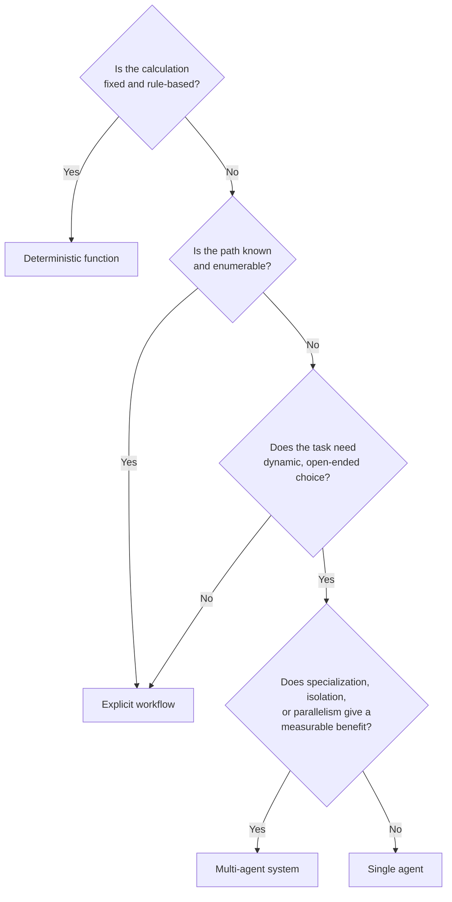

<!-- SPDX-License-Identifier: MIT -->

[← Back to Contents](../README.md) · [Chapter 14: Intelligence and Agent Engineering](../Methodology/chapter-14-intelligence-and-agent-engineering.md) · [Engineering: Tool and Integration Interface Specification →](../engineering/tool-and-integration-interface-specification.md)

# Architecture: OASIS Intelligence-System Reference Architecture

> **PURPOSE** Give a first-pass, technology-neutral reference architecture for the intelligence system described conceptually in [Chapter 14](../Methodology/chapter-14-intelligence-and-agent-engineering.md), so a delivery team has a concrete component diagram to start from instead of reconstructing one from narrative each engagement. This is a starting point for the [Intelligence-System Blueprint](../Methodology/chapter-32-templates-checklists-and-tools.md#11-intelligence-system-blueprint) — tailor components, not the layering discipline, to the engagement.

**Primary OASIS source:** [Chapter 14 — Intelligence and Agent Engineering](../Methodology/chapter-14-intelligence-and-agent-engineering.md) (system equation and sections 1–12), cross-referenced with [Chapter 17 — Enterprise Integration and Tool Engineering](../Methodology/chapter-17-enterprise-integration-and-tool-engineering.md) and [Chapter 19 — Security and Responsible AI Engineering](../Methodology/chapter-19-security-and-responsible-ai-engineering.md) (defense-in-depth layers).

## 1. System equation, as a diagram

Chapter 14 states: **AI system = Model + Context + Harness + Tools + Workflow + Memory/State + Controls + Evaluation + Runtime.** The diagram below arranges those nine components as a request/response flow rather than a flat list.

```mermaid
flowchart TB
    subgraph TRIGGER["Trigger"]
        U[User request / event / schedule]
    end

    subgraph CTX["Context layer (Ch.14 §3-4)"]
        RET[Retrieval & knowledge service]
        MEM[Memory & state store (Ch.14 §8)]
        POL[Policy & instruction library]
        CA[Context assembler<br/>authorization-aware, source-attributed,<br/>fresh, token-budgeted]
        RET --> CA
        MEM --> CA
        POL --> CA
    end

    subgraph HAR["Harness (Ch.14 §6)"]
        LOOP[Execution loop:<br/>assemble → invoke → call tools →<br/>record state → enforce limits →<br/>retry/checkpoint → terminate]
    end

    subgraph MDL["Model layer (Ch.14 §2)"]
        M1[Primary model]
        M2[Fallback model / route]
    end

    subgraph WF["Workflow & orchestration (Ch.14 §7)"]
        DET[Deterministic function]
        EXP[Explicit workflow]
        AGT[Agent]
        MA[Multi-agent]
    end

    subgraph TOOLS["Tools (Ch.14 §5, Ch.17)"]
        T1[Tool / action contract]
        T2[Enterprise API / system of record]
    end

    subgraph CTRL["Controls (Ch.14 §10, Ch.19 defense-in-depth)"]
        GR[Guardrails: input, context, model,<br/>tool, workflow, output, runtime]
    end

    subgraph OUT["Output & human interaction (Ch.14 §9)"]
        VAL[Structured output & validation]
        HAI[Human review / approval / override]
    end

    subgraph EVAL["Evaluation (Ch.14 §11)"]
        EV[Evaluation & regression suite]
    end

    subgraph RUN["Runtime / AgentOps (Ch.14 §12)"]
        TRC[Version + trace: model, prompt,<br/>context, index, tool, workflow, control]
    end

    U --> CA
    CA --> LOOP
    LOOP <--> M1
    LOOP -.fallback.-> M2
    LOOP --> WF
    WF --> DET & EXP & AGT & MA
    AGT --> T1
    MA --> T1
    T1 --> T2
    T1 --> LOOP
    LOOP --> GR
    GR --> VAL
    VAL --> HAI
    HAI --> OUTCOME[Outcome event]
    LOOP --> TRC
    TRC --> EV
    EV -.feedback.-> M1
    EV -.feedback.-> CA
```

## 2. Component-to-artifact map

| # | Component | OASIS engineering section | Design decision it must answer | Primary artifact |
|---|---|---|---|---|
| 1 | Intelligence-system specification | Ch. 14 §1 | What must the system understand, decide, generate or execute — and what is explicitly prohibited? | [Intelligence-System Blueprint](../Methodology/chapter-32-templates-checklists-and-tools.md#11-intelligence-system-blueprint) |
| 2 | Model layer (primary + fallback) | Ch. 14 §2 | Which model/route meets quality, cost and latency thresholds for this task? | Model Strategy and Benchmark |
| 3 | Data, retrieval and knowledge foundations | Ch. 14 §3 | What is the smallest sufficient, authoritative evidence set? | [Data and Knowledge Readiness Assessment](../Methodology/chapter-32-templates-checklists-and-tools.md#8-data-and-knowledge-readiness-assessment) |
| 4 | Context assembler | Ch. 14 §4 | What does the model see at this decision point, and is it authorized, attributed, fresh and bounded? | Context Architecture |
| 5 | Harness (execution loop) | Ch. 14 §6 | How does the task progress, recover and terminate? | Harness and Workflow Design |
| 6 | Workflow/orchestration selector | Ch. 14 §7 | Deterministic function, explicit workflow, single agent, or multi-agent — and why? | Harness and Workflow Design |
| 7 | Tools / action contracts | Ch. 14 §5; Ch. 17 | What can the system access or execute, under what controls? | [Tool and Integration Interface Specification](../engineering/tool-and-integration-interface-specification.md) |
| 8 | Memory and state store | Ch. 14 §8 | What persists, for whom, for how long, and with what correction rights? | Memory and State Policy |
| 9 | Guardrails / controls | Ch. 14 §10; Ch. 19 | Which layer enforces which limit, and what happens on breach? | Risk and Control Register |
| 10 | Output validation & human interaction | Ch. 14 §9 | What schema, evidence and approval does a human or downstream system require? | [Human–AI Workflow Blueprint](../Methodology/chapter-32-templates-checklists-and-tools.md#7-human-ai-workflow-blueprint) |
| 11 | Evaluation & regression suite | Ch. 14 §11 | What constitutes acceptable behavior and change? | [Evaluation Strategy and Dataset](../Methodology/chapter-32-templates-checklists-and-tools.md#9-evaluation-strategy-and-dataset) |
| 12 | Runtime / AgentOps trace | Ch. 14 §12; Ch. 21 | Which version of every component produced this outcome? | [Monitoring: Observability and Telemetry Specification](../monitoring/observability-and-telemetry-specification.md) |

## 3. Defense-in-depth overlay

Chapter 19's eight control layers map directly onto this architecture rather than sitting beside it as a separate concern. Apply controls at the point they are drawn, not only at the perimeter:

| Ch. 19 layer | Where it sits in this architecture |
|---|---|
| Input | Trigger → Context assembler boundary |
| Context | Inside the Context assembler (source trust, authorization filters, injection isolation) |
| Model | Model layer (instructions, safety behavior, restricted capabilities) |
| Tool | Tool/action contracts (allow lists, schemas, least privilege, spend limits) |
| Workflow | Workflow/orchestration selector (approvals, segregation of duties, checkpoints) |
| Output | Output validation stage (grounding, policy, privacy, schema checks) |
| Runtime | Harness execution loop (sandboxing, budgets, containment) |
| Operations | Runtime/AgentOps trace (monitoring, incident response, kill switch, audit) |

## 4. Selecting the orchestration pattern (Ch. 14 §7 decision rule)



Default to the simplest option that satisfies the task. Multi-agent is justified by measured benefit, not by default sophistication — an unjustified multi-agent design is itself an architecture-review finding.

## 5. Tailoring this architecture

Per [Chapter 30 — Tailoring OASIS](../Methodology/chapter-30-tailoring-oasis.md), not every engagement needs every component populated at full depth. A deterministic-function-only system (bottom path in §4) may legitimately omit the Model, Memory and Multi-agent boxes — but should still complete the Controls, Output validation and Runtime trace components, since those apply regardless of how much of the system is "AI."

---

[← Back to Contents](../README.md) · [Chapter 14: Intelligence and Agent Engineering](../Methodology/chapter-14-intelligence-and-agent-engineering.md) · [Engineering: Tool and Integration Interface Specification →](../engineering/tool-and-integration-interface-specification.md)

© 2026 OASIS Methodology contributors. Licensed under the [MIT License](../LICENSE.md).
