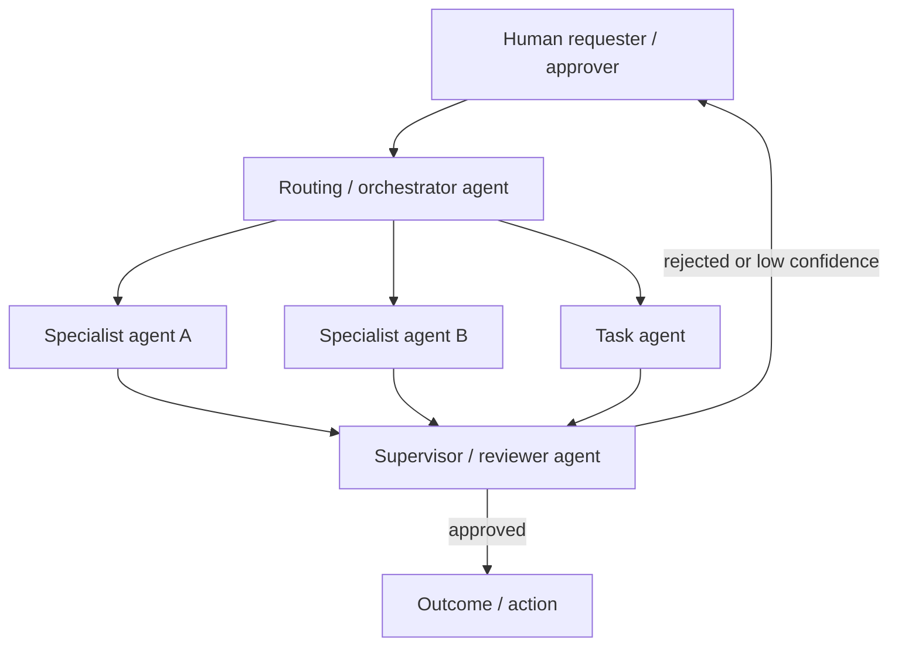

<!-- SPDX-License-Identifier: MIT -->

[← Back to Contents](../README.md) · [← Previous: Business and Capability Architecture](perspective-01-business-and-capability-architecture.md) · [Architecture: Reference Architecture](oasis-reference-architecture.md#6-enterprise-architecture-perspectives) · [Next: Process Architecture →](perspective-03-process-architecture.md)

# Architecture Perspective 2: Agent Architecture

> **PURPOSE** Define the enterprise-wide taxonomy of agent types, their responsibilities, and how agents are permitted to collaborate — the level above a single system's orchestration-pattern choice (Section 4 of the [reference architecture](oasis-reference-architecture.md#4-selecting-the-orchestration-pattern-ch-14-7-decision-rule)), so an enterprise running many agentic systems has one shared vocabulary instead of each team inventing its own.

**Primary OASIS source:** [Chapter 14 §6–7 — Harness and Orchestration](../methodology/chapter-14-intelligence-and-agent-engineering.md); [Chapter 6 — OASIS Operating Model and Decision Rights](../methodology/chapter-06-oasis-operating-model-and-decision-rights.md); [Chapter 16 — Human–AI Workflow and Experience Engineering](../methodology/chapter-16-human-ai-workflow-and-experience-engineering.md).

**Companion repositories:** [Ageis](https://github.com/knowledgetrailsai/Ageis) implements the agentic coding-delivery instance of Chapter 14's agent taxonomy; [Loom](https://github.com/knowledgetrailsai/Loom) implements Chapter 16's human-AI workflow and progressive-autonomy design that this perspective's collaboration rules assume.

## Background and context

Chapter 14 §7 gives a single system the decision rule for choosing deterministic function, explicit workflow, single agent, or multi-agent. It deliberately does not name agent *types* at enterprise scale, because that is an architecture-portfolio decision, not a per-system engineering one. Left unaddressed, this gap produces a familiar failure mode: five teams each build a "customer-facing assistant agent" with incompatible responsibilities, authority levels, and escalation logic, and nobody can answer "which of our agents can independently commit spend?" without reading every system's code. Agent Architecture is the enterprise taxonomy that prevents that — a small, closed set of agent types with clearly bounded responsibilities, so that adding the fortieth agent to the enterprise is a classification exercise against an existing taxonomy, not an ad hoc design decision.

This perspective sits directly above Chapter 14 §6–7: where the reference architecture's Section 4 helps one system's designer pick an orchestration pattern, this document helps a platform owner decide which *kind* of agent is even appropriate for a given capability from Perspective 1's capability map, and how that agent is allowed to interact with other agents already running in production.

## 1. Agent type taxonomy

| Agent type | Responsibility | Typical autonomy ceiling | Escalates to |
|---|---|---|---|
| Task agent | Executes a single bounded task end-to-end (e.g., draft a response, classify a case) within one tool/action surface. | Execute, with human approval gate per [Autonomy Matrix](../methodology/chapter-32-templates-checklists-and-tools.md#12-autonomy-matrix) | Routing agent or human reviewer |
| Routing / orchestrator agent | Decomposes a request and dispatches to task agents or specialist agents; owns no domain tools directly. | Route/coordinate only — no independent execute authority | Supervisor agent or human |
| Specialist agent | Owns deep expertise and tool access in one domain (e.g., pricing, underwriting); called by routing agents, not exposed directly to end users. | Bounded by domain-specific limits in its Tool and Integration spec | Routing agent |
| Supervisor / reviewer agent | Reviews outputs of other agents against policy before release; has no independent execute authority of its own. | Review/approve/reject only | Human reviewer on rejection or low confidence |
| Human-in-the-loop assistant | Drafts, suggests or prepares; a human always takes the executing action. | Prepare only — never execute (Ch.17 category) | N/A — human is always next step |

Every deployed agent must map to exactly one row of this table. An agent that does not fit is either mis-scoped (split it) or the taxonomy needs a deliberate, governed extension — not a one-off exception.

## 2. Hierarchy and collaboration rules

Rules that apply enterprise-wide, not just per system:

- A specialist agent is never called directly by an end user or another enterprise system without passing through a routing agent — this keeps the taxonomy enforceable and the audit trail consistent.
- Inter-agent calls carry the same authorization context as the originating human request (Ch.17: "authorize against requesting user + business context", not agent identity alone) — an agent never gains authority a downstream call does not independently justify.
- Multi-agent collaboration is justified per Chapter 14 §7's decision rule (measurable benefit from specialization, isolation, or parallelism) — the same discipline applies at enterprise scale: adding a new specialist agent type requires a stated benefit, reviewed at architecture governance, not default proliferation.

## 3. Agent registry

Every production agent is registered enterprise-wide, independent of which system owns it:

| Agent ID | Type (per §1) | Owning capability (Perspective 1) | Owning system | Tool/action scope | Autonomy level | Accountable owner |
|---|---|---|---|---|---|---|
| | | | | | | |

## 4. Cross-references

- Per-agent tool contracts: [Tool and Integration Interface Specification](../engineering/tool-and-integration-interface-specification.md).
- Per-agent harness design (single system): [Harness and Orchestration Engineering](../engineering/harness-and-orchestration-engineering.md).
- Autonomy-level governance: [Chapter 10 — Phase 4: Activate & Adopt](../methodology/chapter-10-phase-4-activate-and-adopt.md).
- Human accountability for agent actions: Architecture Principle 2, [Human accountable](oasis-reference-architecture.md#architecture-principles).

---

[← Back to Contents](../README.md) · [← Previous: Business and Capability Architecture](perspective-01-business-and-capability-architecture.md) · [Architecture: Reference Architecture](oasis-reference-architecture.md#6-enterprise-architecture-perspectives) · [Next: Process Architecture →](perspective-03-process-architecture.md)

© 2026 OASIS Methodology contributors. Licensed under the [MIT License](../LICENSE.md).
