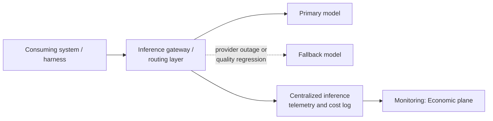

<!-- SPDX-License-Identifier: MIT -->

[← Back to Contents](../README.md) · [← Previous: Information and Knowledge Architecture](perspective-04-information-and-knowledge-architecture.md) · [Architecture: Reference Architecture](oasis-reference-architecture.md#6-enterprise-architecture-perspectives) · [Next: Integration Architecture →](perspective-06-integration-architecture.md)

# Architecture Perspective 5: Inference Architecture

> **PURPOSE** Define how models are consumed, routed and separated at enterprise scale — the enterprise-wide framing of the per-system [Model Engineering](../engineering/model-engineering.md) article, so model procurement, routing and fallback are governed centrally rather than independently re-decided by every build team.

**Primary OASIS source:** [Chapter 14 §2 — Model Layer](../methodology/chapter-14-intelligence-and-agent-engineering.md); [Chapter 22 — Economics, FinOps and Sustainability](../methodology/chapter-22-economics-finops-and-sustainability.md); [Chapter 25 — Enterprise Intelligence Platform](../methodology/chapter-25-enterprise-intelligence-platform.md).

## Background and context

[Model Engineering](../engineering/model-engineering.md) gives a single system a selection framework: benchmark against the task, choose a routing strategy, work up the optimization ladder before defaulting to fine-tuning. Left at that scope, an enterprise running dozens of systems ends up with dozens of independent model procurement decisions, no volume-pricing leverage, no shared fallback strategy when a provider has an outage, and no single view of aggregate inference spend. Inference Architecture is the enterprise layer: which models are approved for use at all, how systems are routed to them, how capacity and cost are pooled, and how a provider-level failure is contained instead of taking down every system that happened to choose the same model.

This is also where the [Model independent](oasis-reference-architecture.md#architecture-principles) principle becomes an enterprise capability rather than a per-system aspiration: an inference layer that mediates access to models through a common routing service is what actually lets any individual system swap models without an application-level rewrite.

## 1. Approved model registry

| Model / route | Provider | Approved use cases | Data handling classification | Cost tier | Fallback route |
|---|---|---|---|---|---|
| | | | | | |

## 2. Inference routing architecture

A centralized inference gateway is not mandatory for every enterprise, but the routing decision, the fallback decision, and the cost/telemetry capture should be architected as a shared capability even if implemented per-system initially — retrofitting a shared gateway after dozens of systems have hard-coded direct model calls is materially more expensive than architecting for it from the second system onward.

## 3. Separation and isolation rules

| Rule | Why |
|---|---|
| Regulated-data workloads route only to models/regions cleared for that data classification | Enforces [Standards](../standards/) obligations (data residency, processing location) at the routing layer rather than trusting every consuming system to self-enforce. |
| No system depends on undocumented model-specific behavior | Supports the [Model independent](oasis-reference-architecture.md#architecture-principles) principle — verified through the evaluation suite (see [Evaluation and Reliability Engineering](../engineering/evaluation-and-reliability-engineering.md)), not through code review alone. |
| Fallback routes are tested, not theoretical | A documented fallback model that has never been exercised in production is not a functioning fallback — schedule periodic fallback drills alongside the [Production learning loop](../monitoring/observability-and-telemetry-specification.md#5-production-learning-loop-as-a-runbook). |
| High-risk and low-risk workloads are not silently co-routed | A routing rule change (e.g., cost optimization) must be reviewed against every workload's risk classification before it is applied broadly. |

## 4. Cost governance

Aggregate inference spend is tracked centrally against the [Economic plane](../monitoring/observability-and-telemetry-specification.md#economic-plane) metrics, rolled up across all consuming systems — a single system's Value and Risk Case budget is a component of this enterprise total, not a substitute for tracking it.

---

[← Back to Contents](../README.md) · [← Previous: Information and Knowledge Architecture](perspective-04-information-and-knowledge-architecture.md) · [Architecture: Reference Architecture](oasis-reference-architecture.md#6-enterprise-architecture-perspectives) · [Next: Integration Architecture →](perspective-06-integration-architecture.md)

© 2026 OASIS Methodology contributors. Licensed under the [MIT License](../LICENSE.md).
