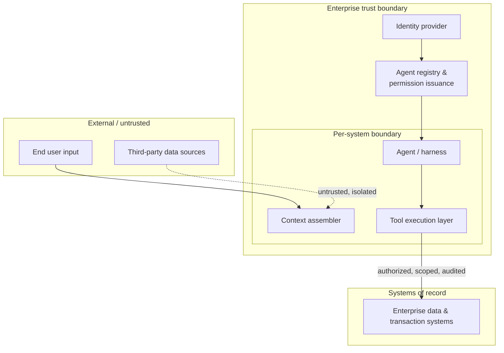

<!-- SPDX-License-Identifier: MIT -->

[← Back to Contents](../README.md) · [← Previous: Deployment Architecture](perspective-07-deployment-architecture.md) · [Architecture: Reference Architecture](oasis-reference-architecture.md#6-enterprise-architecture-perspectives) · [Next: Operations and Observability Architecture →](perspective-09-operations-and-observability-architecture.md)

# Architecture Perspective 8: Security and Trust Architecture

> **PURPOSE** Define identity, boundaries, permissions and data controls at the enterprise level — the enterprise-wide framing of the [Security: Threat and Control Checklist](../security/agentic-ai-threat-and-control-checklist.md), covering the shared identity and trust model every agent, tool integration and system must operate within, rather than restating per-system controls.

**Primary OASIS source:** [Chapter 19 — Security and Responsible AI Engineering](../methodology/chapter-19-security-and-responsible-ai-engineering.md); [Security: Threat and Control Checklist](../security/agentic-ai-threat-and-control-checklist.md); [Chapter 20 — Governance, Compliance and Regulatory Engineering](../methodology/chapter-20-governance-compliance-and-regulatory-engineering.md).

**Companion repositories:** [Compass](https://github.com/knowledgetrailsai/responsible-ai) (`14-ai-security/`) is the policy and control catalog behind Chapters 19–20; [Helm](https://github.com/knowledgetrailsai/Helm)'s [agentic threat model](https://github.com/knowledgetrailsai/Helm/blob/main/06-security-and-containment/agentic-threat-model.md) covers the runtime containment layer that enforces the identity and trust model this perspective defines.

## Background and context

The Security checklist specifies Chapter 19's eight defense-in-depth layers and the agentic threat model at the level a single system's security reviewer applies them. Security and Trust Architecture is the layer above that: the shared identity model, trust boundaries, and permission-issuance process that every system's controls are configured *against*.

Without an enterprise trust architecture, "authorize against requesting user + business context" (the Tool specification's authorization rule) has no consistent enterprise identity source to authorize against. Every system either builds its own identity and permission model, or worse, borrows service-account credentials never designed for agent-scale, high-frequency, semi-autonomous calling patterns.

This perspective is where identity, agent-to-agent trust, and enterprise-wide permission issuance are architected once. Every per-system Security checklist review can then assume a consistent identity foundation instead of re-litigating it.

## 1. Identity and trust model

Compass's [identity and authorization](https://github.com/knowledgetrailsai/responsible-ai/blob/main/07-agentic-ai/identity-and-authorization.md) note works through the agent-identity row below in more depth.

| Identity type | How it is issued | How it is scoped | How it is revoked |
|---|---|---|---|
| Human user identity | Enterprise identity provider (existing SSO/IAM) | Role- and entitlement-based, per existing enterprise access model | Standard enterprise deprovisioning |
| Agent identity | Distinct from any human or service-account identity it acts on behalf of — see the [Model independent](oasis-reference-architecture.md#architecture-principles) and authorization rule in the Tool specification | Scoped to the [Agent Architecture](perspective-02-agent-architecture.md) type and registered tool/action surface | Centralized agent registry (Perspective 2, §3) — immediate revocation capability required |
| Tool/service credential | Per integration, via the enterprise credential registry (see [Integration Architecture §2](perspective-06-integration-architecture.md#2-shared-connector-governance)) | Least-privilege scope matching the specific tool contract | Centralized credential registry; revocation must not require a code deployment |
| Inter-agent trust | Agent A's call to Agent B carries the originating human/business authorization context, never an elevated authority of its own | Bounded by the calling agent's own scope — no privilege escalation across agent-to-agent calls | Inherits revocation of the underlying authorization context |

## 2. Trust boundaries

Content crossing from External into the Enterprise trust boundary is treated per Chapter 19's Input and Context control layers — never trusted by default regardless of source reputation. Content or actions crossing into Systems of record require the full authorization, confirmation and audit trail specified in the [Tool and Integration Interface Specification](../engineering/tool-and-integration-interface-specification.md).

## 3. Enterprise permission issuance principles

| Principle | What it requires |
|---|---|
| No standing broad-scope credentials for agents | Every agent credential is scoped to its registered tool/action surface (Perspective 2, §3) — a general-purpose, broadly-scoped service account is a Security-checklist finding, not an accepted shortcut. |
| Permission changes are auditable events | Any change to an agent's scope is logged with requester, approver and timestamp — feeding the same [trace and version record](../monitoring/observability-and-telemetry-specification.md#2-trace-and-version-record-what-every-event-must-carry) pattern used for releases. |
| Kill-switch authority is pre-assigned | The Security checklist's containment procedures name who can revoke an agent's access immediately; this perspective ensures that authority has a working technical path (centralized registry, not per-system credential stores) to act on. |
| Data classification travels with permission scope | A credential scoped to Restricted or Regulated data (per [Information and Knowledge Architecture](perspective-04-information-and-knowledge-architecture.md#1-enterprise-knowledge-domain-map)) is reviewed at a higher cadence than one scoped to Public or Internal data. |

## 4. Cross-references

- Layer-by-layer control detail: [Security: Threat and Control Checklist](../security/agentic-ai-threat-and-control-checklist.md).
- Regulatory obligations shaping trust design: [Regulatory and Standards Framework Alignment Index](../references/regulatory-framework-alignment-index.md).
- Credential and integration governance: [Integration Architecture](perspective-06-integration-architecture.md).

---

[← Back to Contents](../README.md) · [← Previous: Deployment Architecture](perspective-07-deployment-architecture.md) · [Architecture: Reference Architecture](oasis-reference-architecture.md#6-enterprise-architecture-perspectives) · [Next: Operations and Observability Architecture →](perspective-09-operations-and-observability-architecture.md)

© 2026 OASIS Methodology contributors. Licensed under the [MIT License](../LICENSE.md).
