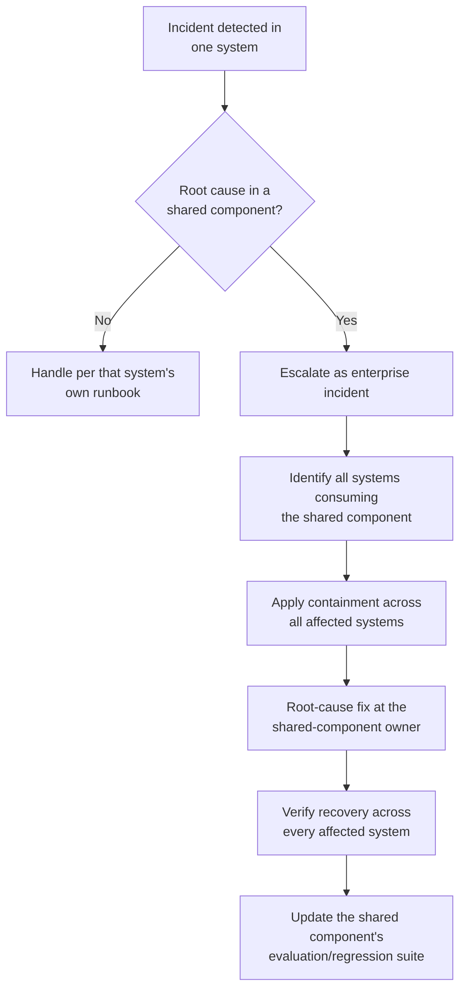

<!-- SPDX-License-Identifier: MIT -->

[← Back to Contents](../README.md) · [← Previous: Security and Trust Architecture](perspective-08-security-and-trust-architecture.md) · [Architecture: Reference Architecture](oasis-reference-architecture.md#6-enterprise-architecture-perspectives)

# Architecture Perspective 9: Operations and Observability Architecture

> **PURPOSE** Define how the agentic estate is monitored, governed and controlled at the enterprise level — the enterprise-wide framing of the [Monitoring: Observability and Telemetry Specification](../monitoring/observability-and-telemetry-specification.md), covering the shared operating model, aggregate dashboards and governance cadence across every deployed system rather than one system's telemetry alone.

**Primary OASIS source:** [Chapter 21 — Deployment, Operations and AgentOps](../methodology/chapter-21-deployment-operations-and-agentops.md); [Chapter 26 — OASIS Measurement Framework](../methodology/chapter-26-oasis-measurement-framework.md); [Chapter 27 — Delivery Cadence and Management Practices](../methodology/chapter-27-delivery-cadence-and-management-practices.md).

## Background and context

The Monitoring specification instruments Chapter 21's six operational planes for a single system: what to measure, where to collect it, when to alert. Operations and Observability Architecture is the enterprise rollup: once an enterprise has more than a handful of production intelligence systems, a governance function needs one view across all of them — which systems are healthy, which are in a degraded or under-review state, aggregate spend and outcome performance, and a consistent incident-response and kill-switch capability that works the same way regardless of which team built the system in question. Without this enterprise layer, each system's excellent per-system telemetry never rolls up into a portfolio view, and an enterprise-wide incident (e.g., a shared model provider outage, or a systemic prompt-injection pattern discovered in one system that likely also affects others) has no mechanism to be detected or responded to as an enterprise event.

This perspective is where AgentOps becomes a governance function, not just an engineering discipline — the natural home for the governance forums named in [Chapter 24](../methodology/chapter-24-roles-teams-and-governance-forums.md).

## 1. Enterprise operations dashboard — rollup structure

| Rollup view | Source | Reviewed by | Cadence |
|---|---|---|---|
| Portfolio health (per system: service/intelligence/risk status) | Per-system [Monitoring specifications](../monitoring/observability-and-telemetry-specification.md) | AI governance forum | Weekly |
| Aggregate economic plane (total inference + infrastructure + intervention cost) | [Inference Architecture](perspective-05-inference-architecture.md#4-cost-governance) cost log, rolled up | FinOps / governance forum | Monthly |
| Aggregate outcome plane (portfolio-level value delivered vs. Outcome Contracts) | Per-system Outcome Scorecards | Executive sponsor / steering committee | Per delivery cadence (Ch.27) |
| Aggregate risk and incident register | Per-system Risk and Control Registers, plus enterprise-wide incidents | Risk/security governance forum | Weekly, immediate for zero-tolerance events |
| Agent registry and autonomy census (which agents exist, at what autonomy level) | [Agent Architecture registry](perspective-02-agent-architecture.md#3-agent-registry) | AI governance forum | Monthly |

## 2. Enterprise incident response

An incident affecting a shared component (Perspective 5's inference gateway, Perspective 6's shared integration, Perspective 4's shared knowledge domain) is classified and responded to as an enterprise incident, not a single system's incident, because its blast radius spans every consuming system:

This depends on Perspectives 4–6 being maintained as accurate registries — an enterprise incident response is only as fast as the registry that tells responders which systems are affected.

## 3. Enterprise kill-switch and containment authority

| Scope | Who can invoke | What it does |
|---|---|---|
| Single agent | System owner, per that system's own runbook | Suspends the specific agent, per the Security checklist's [containment procedures](../security/agentic-ai-threat-and-control-checklist.md#4-containment-and-emergency-control-checklist) |
| Shared component (model route, integration, knowledge domain) | Enterprise platform owner (Perspective 5/6/4 owner) | Suspends the shared component for all consuming systems simultaneously — requires the centralized registries in §1 to identify blast radius correctly |
| Enterprise-wide agentic estate | AI governance forum chair or designated executive | Emergency-only; suspends autonomous execution across the estate, reverting to human-in-the-loop, pending investigation |

## 4. Governance cadence

Operations and Observability Architecture is reviewed at the same governance forums Chapter 24 establishes, with this rollup as their standing input — a governance forum without an enterprise-level operations view is reduced to reviewing whichever system's problems happen to be escalated verbally, rather than the actual state of the portfolio.

---

[← Back to Contents](../README.md) · [← Previous: Security and Trust Architecture](perspective-08-security-and-trust-architecture.md) · [Architecture: Reference Architecture](oasis-reference-architecture.md#6-enterprise-architecture-perspectives)

© 2026 OASIS Methodology contributors. Licensed under the [MIT License](../LICENSE.md).
