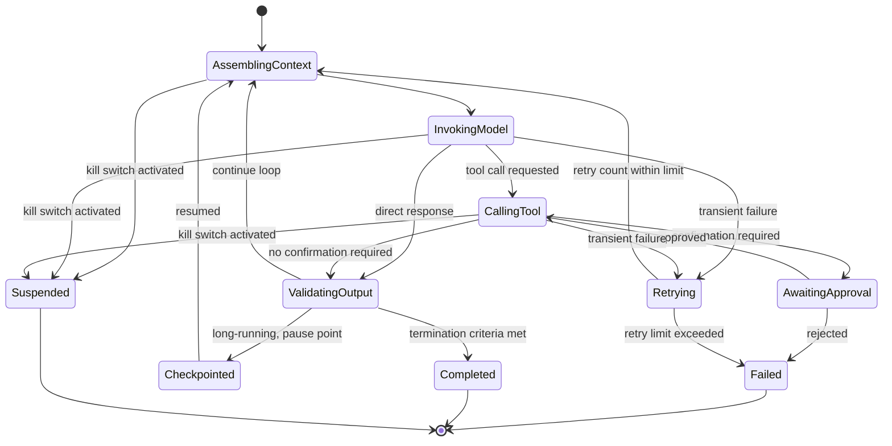

<!-- SPDX-License-Identifier: MIT -->

[← Back to Contents](../README.md) · [← Previous: Tool and Integration Interface Specification](tool-and-integration-interface-specification.md) · [Chapter 14: Intelligence and Agent Engineering](../Methodology/chapter-14-intelligence-and-agent-engineering.md) · [Architecture: Orchestration pattern decision](../architecture/oasis-reference-architecture.md#4-selecting-the-orchestration-pattern-ch-14-7-decision-rule) · [Next: Memory and State Engineering →](memory-and-state-engineering.md)

# Engineering: Harness and Orchestration Engineering

> **PURPOSE** Turn Chapter 14 §6–7's harness and orchestration principles into an implementable responsibility checklist, pattern-selection implementation notes, and a state-machine template. The [Architecture Reference Architecture](../architecture/oasis-reference-architecture.md#4-selecting-the-orchestration-pattern-ch-14-7-decision-rule) already covers *which* pattern to choose; this document covers *how to implement* whichever one is chosen.

**Primary OASIS source:** [Chapter 14 §6 — Agent-Harness Engineering](../Methodology/chapter-14-intelligence-and-agent-engineering.md#6-agent-harness-engineering) and [§7 — Workflow and Orchestration Engineering](../Methodology/chapter-14-intelligence-and-agent-engineering.md#7-workflow-and-orchestration-engineering); cross-referenced with [Chapter 19 — Guardrails](../Methodology/chapter-19-security-and-responsible-ai-engineering.md) and the [Monitoring spec's](../monitoring/observability-and-telemetry-specification.md) trace schema.

## Background and context

Chapter 14's own comparison table draws the cleanest line between context engineering and harness engineering: context engineering determines what the model sees *now*, at a single decision point; harness engineering determines how the system completes the task *end to end* — running loops, calling tools, tracking state, retrying, checkpointing, and recognizing when it is actually done. The distinction matters operationally because the two fail differently. A context failure produces a wrong answer to a well-posed question. A harness failure produces a system that never terminates, retries a non-idempotent action twice, loses track of partial progress after a crash, or cannot tell the difference between "the task succeeded" and "the task ran out of steps." These are software-engineering failures more than model-quality failures, and they are exactly as amenable to conventional engineering discipline — state machines, idempotency keys, checkpointing, circuit breakers — as any other distributed system, which is the framing this document takes rather than treating the harness as an emergent property of "the agent."

Orchestration pattern selection (Section 2 below, and the [Architecture document's decision tree](../architecture/oasis-reference-architecture.md#4-selecting-the-orchestration-pattern-ch-14-7-decision-rule)) is a genuinely consequential engineering decision, not a style preference. Chapter 14 is explicit that deterministic functions, explicit workflows, single agents, and multi-agent systems are progressively more expensive to build, evaluate, and operate, and each should only be chosen when the task actually requires the flexibility the next tier up provides — a fixed calculation implemented as an agent call is strictly worse (slower, less predictable, harder to test, more expensive) than the same calculation implemented as a function, and a multi-agent system chosen for its own sake, without a measured benefit from specialization, isolation, or parallelism, is a maintenance burden with no offsetting advantage. Chapter 14 §7 states this as a rule, not a suggestion; Section 2 of this document treats an unjustified escalation up this ladder as an architecture-review finding, the same way the Architecture document does.

**How to use this document:** use Section 1 as an implementation checklist for whatever harness is being built, regardless of which orchestration pattern was selected. Use Section 2 once the pattern is chosen (via the Architecture decision tree) to understand the implementation-level considerations specific to that pattern. Use Section 3 to design the harness's own internal state machine, and Section 4 to set the operating limits that bound its behavior in production.

## 1. Harness responsibility checklist

Every harness, regardless of orchestration pattern, must fulfil these responsibilities. Mark how each is implemented, not just whether it exists.

| # | Responsibility | Implementation note | Status |
|---|---|---|---|
| 1 | Assemble context | Calls the context architecture (see [Context and Retrieval Engineering](context-and-retrieval-engineering.md#1-context-architecture-template)) at each decision point, not just once at task start | |
| 2 | Invoke model | Handles primary/fallback routing per [Model Strategy](model-engineering.md#3-model-strategy-and-routing-design) | |
| 3 | Register and call tools | Enforces the tool contract's preconditions, limits and confirmation requirements (see [Tool and Integration spec](tool-and-integration-interface-specification.md#1-tool-contract-template)) before every call | |
| 4 | Record state | Persists step, artifact, approval, tool-result and error state at each transition, not only at completion | |
| 5 | Process results | Validates tool/model outputs against expected schema before acting on them | |
| 6 | Enforce limits | Applies the operating limits in Section 4 at every step, not only at task start | |
| 7 | Request approval | Pauses and surfaces evidence to a human at points defined by the [Human–AI Workflow Blueprint](../tools/02-workflow-and-intelligence-templates.md#7-human-ai-workflow-blueprint) | |
| 8 | Retry safely | Retries only idempotent operations, and tracks retry count against the limit in Section 4 | |
| 9 | Checkpoint long work | Persists enough state that a crash mid-task can resume without repeating completed, non-idempotent steps | |
| 10 | Terminate on explicit criteria | Defines success, failure and "give up" conditions explicitly — an agent loop with no termination condition is a defect, not a feature | |

## 2. Orchestration pattern implementation notes

Use the [Architecture decision tree](../architecture/oasis-reference-architecture.md#4-selecting-the-orchestration-pattern-ch-14-7-decision-rule) to choose a pattern; use this table once chosen.

| Pattern | Implementation consideration | Common pitfall |
|---|---|---|
| Sequential | Each step's output becomes the next step's input; failure at step N should not silently continue to N+1 | Swallowing a mid-sequence failure and producing a plausible but wrong final result |
| Concurrent | Steps run in parallel and results are merged; requires explicit conflict resolution if steps touch shared state | Race conditions when two concurrent steps write to the same downstream system |
| Routing | An early step classifies the task and routes to a specialized path | Routing classifier itself becomes an unmonitored single point of failure — evaluate it like any other model-driven decision |
| Hand-off | One agent/workflow explicitly transfers ownership of a task to another | Losing context or authority scope at the hand-off boundary — the receiving agent must not inherit more authority than it was explicitly granted |
| Supervisor | A coordinating agent delegates to and monitors specialized sub-agents | Supervisor becomes a bottleneck or a single point of failure if it lacks its own fallback/escalation path |
| Human-in-the-loop | A human step is a first-class node in the orchestration, not an exception path | Treating the human step as "outside" the harness, so it has no timeout, escalation, or state-recovery behavior of its own |

Every pattern above requires state, ownership and recovery per Chapter 14 §7 — "ownership" means a named accountable role per the [Responsibility Assignment Matrix](../tools/03-system-and-governance-templates.md#19-responsibility-assignment-matrix), not just a technical component.

## 3. Harness state machine template



Adapt states to the specific harness — this is a starting skeleton, not a mandated implementation. The two states worth never omitting are **Checkpointed** (so long-running work survives a restart) and **Suspended** (so the [containment and kill-switch checklist](../security/agentic-ai-threat-and-control-checklist.md#4-containment-and-emergency-control-checklist) has somewhere to transition to from any other state).

## 4. Limits and budgets configuration

```yaml
harness_limits:
  iteration_limit: ""                 # max loop iterations before forced termination
  time_limit: ""                      # wall-clock budget for the full task
  token_limit: ""                     # cumulative token budget across all model calls in the task
  cost_limit: ""                      # cumulative cost budget — link to Monitoring economic plane
  transaction_limit: ""               # max monetary/business value this task can commit
  retry_limit: ""
  on_limit_exceeded: "fail | escalate to human | fall back to deterministic path"
```

Set these limits deliberately, not to framework defaults — see the [Monitoring spec's economic plane](../monitoring/observability-and-telemetry-specification.md#economic-plane) for how they're monitored in production and the [Security checklist's containment section](../security/agentic-ai-threat-and-control-checklist.md#4-containment-and-emergency-control-checklist) for how they relate to blast-radius definition.

---

[← Back to Contents](../README.md) · [← Previous: Tool and Integration Interface Specification](tool-and-integration-interface-specification.md) · [Chapter 14: Intelligence and Agent Engineering](../Methodology/chapter-14-intelligence-and-agent-engineering.md) · [Architecture: Orchestration pattern decision](../architecture/oasis-reference-architecture.md#4-selecting-the-orchestration-pattern-ch-14-7-decision-rule) · [Next: Memory and State Engineering →](memory-and-state-engineering.md)

© 2026 OASIS Methodology contributors. Licensed under the [MIT License](../LICENSE.md).
