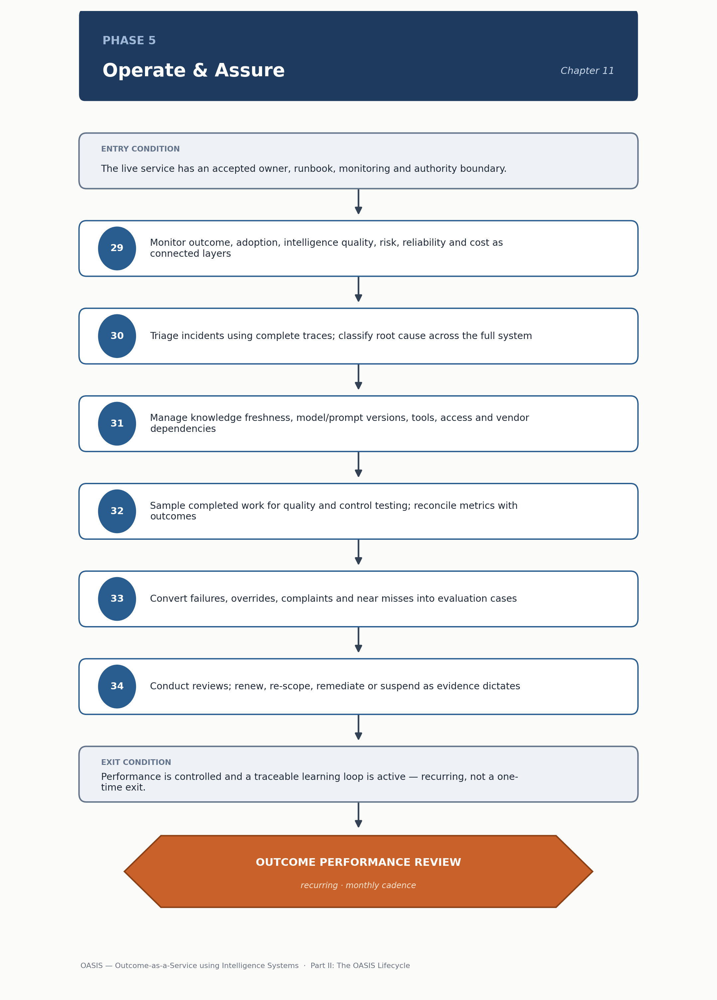

<!-- SPDX-License-Identifier: MIT -->

[← Previous: Chapter 10: Phase 4 — Activate & Adopt](chapter-10-phase-4-activate-and-adopt.md) · [Contents](../README.md) · [Next: Chapter 12: Phase 6 — Optimize & Scale →](chapter-12-phase-6-optimize-and-scale.md)

# Chapter 11: Phase 5 — Operate & Assure

# Phase 5 — Operate & Assure

> **CHAPTER PURPOSE** Sustain service health, intelligence quality, controls and business outcomes through monitoring, incident management and continuous assurance.

## Background and context

Phase 4 earns a service its initial operating authority. Phase 5 is where that authority must be continuously re-earned, because nothing about a production intelligence system stays still. Retrieved knowledge goes stale, the model gets upgraded or deprecated by a provider, the workflow gets redesigned around it, and the user population shifts what "normal" input looks like. Phase 5 is the longest-running phase — most systems spend years here — keeping outcome, intelligence quality and controls within agreed limits despite that drift.

This is where the handbook's monitoring and security material becomes operating discipline. The [Observability and Telemetry Specification](../monitoring/observability-and-telemetry-specification.md#1-the-six-operational-planes-instrumented) defines six operational planes — service, intelligence, risk, human, economic and outcome — that a healthy operating rhythm monitors together. A service healthy on the service plane (uptime, latency) can still be failing on the intelligence plane (accuracy, groundedness) or the risk plane (control breaches). Watching only one plane misses the others until a customer or regulator finds them first. The [Agentic AI Threat and Control Checklist](../security/agentic-ai-threat-and-control-checklist.md#4-containment-and-emergency-control-checklist) specifies the containment and emergency-control procedures this phase relies on during an incident.

Phase 5 feeds [Phase 6 — Optimize & Scale](chapter-12-phase-6-optimize-and-scale.md) its raw material: accumulated production evidence — what failed, what drifted, what users actually did — that makes optimization and scale decisions evidenced rather than speculative.

*Figure 10. Phase 5 — Operate & Assure: method sequence and the recurring Outcome Performance Review.*

## Phase objective

Sustain service health, intelligence quality, control effectiveness and business outcomes within agreed limits.

"Sustain" does real work here — it does not mean "leave alone." A system left alone degrades as the world around it keeps changing. Sustaining health means active monitoring, incident response and periodic reassessment, so degradation is caught before it becomes visible to the business.

## Core questions

- Is the outcome being delivered consistently?

- Where are users intervening and why?

- Are controls effective and proportionate?

- Has any component, data source, user behavior or external obligation changed?

The second question is one of the most useful for diagnosis. Where and why users override or escalate output is often the richest evidence of where a system is failing — richer than automated metrics, because intervention concentrates on the cases it handles worst. A team that doesn't systematically capture that pattern is throwing away its best source of improvement ideas.

## Method

29. Monitor outcome, adoption, intelligence quality, risk, reliability, cost and intervention as connected layers.

30. Triage incidents using complete traces and classify root cause across the full intelligence system.

31. Manage knowledge freshness, model and prompt versions, tools, access, capacity, vendors and dependencies.

32. Sample completed work for quality and control testing; reconcile operational metrics with business outcomes.

33. Convert failures, overrides, complaints and near misses into evaluation cases and corrective actions.

34. Conduct service, outcome and compliance reviews; renew, re-scope, remediate or suspend as evidence dictates.

Step 29's instruction to monitor these layers "as connected" is the practical fix for the false-comfort problem above. Step 30's incident triage depends on the trace and version record in the [Monitoring specification](../monitoring/observability-and-telemetry-specification.md#2-trace-and-version-record-what-every-event-must-carry). An incident that can't be reconstructed from a complete trace becomes guesswork, and the [responsible-layer incident taxonomy](../monitoring/observability-and-telemetry-specification.md#4-incident-classification-responsible-layer-taxonomy) prevents that. Step 33 closes the phase's most important loop: any failure, override or near miss that never becomes a regression case is a lesson the system relearns the hard way, in production, more than once.

## Primary artifacts

- Outcome and Assurance Scorecard

- Service Runbook

- Incident and Problem Records

- Drift and Change Register

- Control Evidence Pack

- Learning Backlog

- Monthly Outcome Review

The Outcome and Assurance Scorecard corresponds to the Outcome Scorecard, template 15 in [Readiness and Operations Templates](../tools/04-readiness-and-operations-templates.md#15-outcome-scorecard); its dimensions map to the six operational planes above. The Service Runbook is template 16 in the same file, [Readiness and Operations Templates](../tools/04-readiness-and-operations-templates.md#16-service-runbook) — the document the on-call team opens during an incident. Step 22 of Phase 3 already produced it, so it should never be rebuilt from scratch. The Control Evidence Pack draws on the Risk and Control Register, template 17 in [Risk and Scale Templates](../tools/05-risk-and-scale-templates.md#17-risk-and-control-register) — the single shared risk register that the [Standards](../standards/) checklists and the Security checklist reference rather than duplicate.

> **DECISION OUTCOME** Outcome Performance Review: continue, correct, re-scope, reduce authority or retire.

## Entry and exit conditions

| **Entry condition**                                                                 | **Exit condition**                                                 |
|------------------------------------------------------------------------------------------|------------------------------------------------------------------------|
| The live service has an accepted owner, runbook, monitoring and authority boundary. | Performance is controlled and a traceable learning loop is active. |

There is no fixed calendar exit from Phase 5 as the other phases have — a healthy service can remain here indefinitely, cycling through monitoring and review, until a problem forces reduced authority or accumulated evidence justifies moving into Phase 6.

## Tailoring guidance

Cadence follows volatility and consequence. A stable internal assistant may be reviewed monthly; a safety- or customer-critical action system may require continuous alerts and daily controls.

The right cadence depends on how fast things can go wrong, and how bad it would be. A low-stakes internal tool with a stable knowledge base can be reviewed monthly. A system that can take irreversible customer-facing action, or operates where regulatory obligations shift, needs continuous alerting and daily control checks.

---

[← Previous: Chapter 10: Phase 4 — Activate & Adopt](chapter-10-phase-4-activate-and-adopt.md) · [Contents](../README.md) · [Next: Chapter 12: Phase 6 — Optimize & Scale →](chapter-12-phase-6-optimize-and-scale.md)

© 2026 OASIS Methodology contributors. Licensed under the [MIT License](../LICENSE.md).
