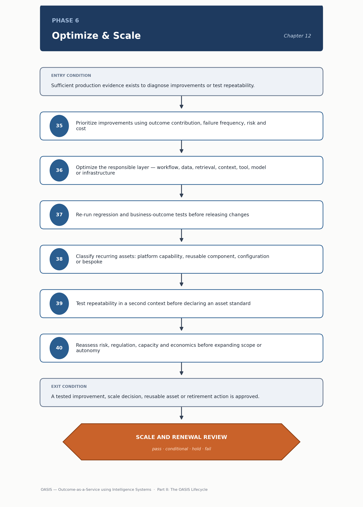

<!-- SPDX-License-Identifier: MIT -->

[← Previous: Chapter 11: Phase 5 — Operate & Assure](chapter-11-phase-5-operate-and-assure.md) · [Contents](../README.md) · [Next: Chapter 13: Decision Gates and Evidence Model →](chapter-13-decision-gates-and-evidence-model.md)

# Chapter 12: Phase 6 — Optimize & Scale

# Phase 6 — Optimize & Scale

> **CHAPTER PURPOSE** Improve performance, expand justified autonomy, productize recurring patterns and scale only where production evidence supports reuse.

## Background and context

Phase 5 generates the evidence. Phase 6 acts on it deliberately, instead of letting it pile up as an unprioritized backlog. It is the phase most easily skipped under delivery pressure — a system within acceptable limits can look finished, so teams move to the next opportunity instead of generalizing what works. That instinct is usually costly. The same failure patterns and reusable components recur across a portfolio, and a methodology that never asks "what repeats" ends up rebuilding the same pipeline, guardrail logic and evaluation suite for every new use case.

This phase has two distinct halves sharing a chapter because they draw on the same evidence base. Optimization is local: it improves quality, latency, cost or adoption for the system that exists. Scale is generalization: it recognizes that a component built for one deployment is stable enough to become a shared platform asset. Confusing the two causes this phase's two most common mistakes — optimizing a system that should be retired, and prematurely productizing a component tested in only one context. The capability-reuse discipline here connects to [Architecture Perspective 1: Business and Capability Architecture](../architecture/perspective-01-business-and-capability-architecture.md#3-capability-portfolio-view), where capability consolidation is tracked at the enterprise level.

Phase 6 is also where the lifecycle loops back on itself: an optimization or scale decision that meaningfully changes behavior, user base, exposure or authority doesn't just get released — it re-enters the gate structure in [Chapter 13](chapter-13-decision-gates-and-evidence-model.md), because a materially different system deserves the same evidence discipline a new one would.

*Figure 11. Phase 6 — Optimize & Scale: method sequence and the Scale and Renewal Review gate.*

## Phase objective

Improve quality, latency, economics and adoption; expand justified autonomy; and convert recurring patterns into reusable capability.

Each objective fails differently if pursued alone. Optimization without a scale lens produces a system that's excellent but unrepeatable. Scale without optimizing first productizes a component before it's good, baking its flaws into every future reuse. Autonomy expansion pursued alone treats trust as something that accrues automatically, rather than something earned against fresh evidence each time authority increases.

## Core questions

- What should improve locally?

- What repeats across deployments?

- What belongs in platform, component or configuration?

- Is expansion economically and operationally justified?

The third question is where most ambiguity in enterprise AI programs lives. Not everything that repeats belongs in a shared platform component. Some things repeat because they're genuinely common, and some merely look similar while differing in details that matter — data sensitivity, regulatory obligation, user population. Distinguishing platform capability from business configuration from bespoke need is a judgment call: over-productizing forces every consumer into a component that doesn't fit, while under-productizing means teams independently rebuild the same thing.

## Method

35. Prioritize improvements using outcome contribution, failure frequency, risk, intervention and cost.

36. Optimize the responsible layer: workflow, data, retrieval, context, tool, harness, model, infrastructure or user experience.

37. Re-run regression and business-outcome tests before releasing changes.

38. Classify recurring assets as platform capability, reusable deployment component, business configuration or bespoke need.

39. Test repeatability in a second context before declaring an asset standard.

40. Reassess risk, regulation, capacity, support and economics before expanding users, geography, data, action authority or autonomy.

Step 36's instruction to optimize "the responsible layer," not the first plausible lever, continues the failure classification from Phase 2 and Phase 5's incident triage. A latency problem caused by an inefficient retrieval pipeline won't be fixed by swapping the model, and misdiagnosing the layer just wastes a cycle without moving the metric. Step 39 is easy, and expensive, to skip: an asset run only in its original context has demonstrated it worked once, not that it's reusable. Declaring it a standard on one deployment is how "shared" components end up assuming something specific to their first user. Step 40's reassessment echoes the methodology's evidence-gating discipline: expanding scope deserves fresh evidence, not an assumption that what worked now keeps working at the next scale.

## Primary artifacts

- Optimization Backlog

- Scale and Productization Assessment

- Reusable Asset Register

- Expanded Evaluation Pack

- Autonomy Evidence Pack

- Renewal Business Case

- Retirement Plan where applicable

The Scale and Productization Assessment is template 18 in [Risk and Scale Templates](../tools/05-risk-and-scale-templates.md#18-scale-and-productization-assessment), worth reading before productization decisions, not after — its fields (demand, repeatability, contract stability, tenancy model, unit economics) are exactly what step 38's classification and step 40's expansion decision need.

> **DECISION OUTCOME** Scale and Renewal Review: improve, replicate, productize, renew, redesign or retire.

## Entry and exit conditions

| **Entry condition**                                                                   | **Exit condition**                                                                      |
|-------------------------------------------------------------------------------------------|-------------------------------------------------------------------------------------------|
| Sufficient production evidence exists to diagnose improvements or test repeatability. | A tested improvement, scale decision, reusable asset or retirement action is approved. |

The entry condition's "sufficient production evidence" is a reminder that this phase draws on Phase 5, not around it. A system without a meaningful operating history has nothing reliable to optimize from, and starting early usually just means optimizing against noise.

## Tailoring guidance

Small organizations may reuse through templates and managed services. Large enterprises should establish product owners, service levels, version support and federated governance for shared components.

Organizational size changes the right answer here more than in most other phases. A small organization rarely has the deployment volume to justify a formal platform team; reuse there looks like good templates and shared configuration, carried by discipline rather than dedicated ownership. A large enterprise running many deployments needs shared components to behave like products — named owners, defined service levels, a supported version history, governance spanning consuming business units. Without that, an informally maintained shared component at that scale becomes a single point of failure for everyone depending on it.

---

[← Previous: Chapter 11: Phase 5 — Operate & Assure](chapter-11-phase-5-operate-and-assure.md) · [Contents](../README.md) · [Next: Chapter 13: Decision Gates and Evidence Model →](chapter-13-decision-gates-and-evidence-model.md)

© 2026 OASIS Methodology contributors. Licensed under the [MIT License](../LICENSE.md).
