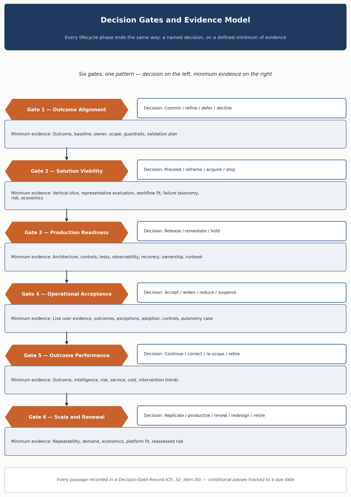

<!-- SPDX-License-Identifier: MIT -->

[← Previous: Chapter 12: Phase 6 — Optimize & Scale](chapter-12-phase-6-optimize-and-scale.md) · [Contents](../README.md) · [Next: Part III: Intelligence-System Engineering and Assurance →](part-iii-intelligence-system-engineering-and-assurance.md)

# Chapter 13: Decision Gates and Evidence Model

> **CHAPTER PURPOSE** Use proportionate evidence reviews to commit, proceed, release, widen, scale, redesign or retire without turning governance into ceremonial approval.

## Background and context

Every one of the six lifecycle phases in Chapters 7 through 12 ends the same way: a named decision outcome, reached by reviewing a defined minimum of evidence against the claim the phase was meant to test. This chapter states that pattern once, instead of repeating it with minor variation six times. Gates make the rest of the methodology enforceable. A phase description is just good intentions until something checks, at a defined point, whether its exit condition was actually met.

This is not a stage-gate bureaucracy. A gate is not a form to file; it is a decision, made by someone accountable, on evidence that would hold up to a skeptical outsider's questions. This chapter closes [Part II: The OASIS Lifecycle](part-ii-the-oasis-lifecycle.md) at the boundary with [Part III's](part-iii-intelligence-system-engineering-and-assurance.md) engineering and assurance material, because a gate consumes the evidence that work produces — it does not generate its own.

Two artifacts make this model operable. Every gate passage should be recorded using the [Decision-Gate Record](../tools/03-system-and-governance-templates.md#20-decision-gate-record), template 20 in [System and Governance Templates](../tools/03-system-and-governance-templates.md) — a six-phase engagement produces at least six of these, and a conditional pass or hold is tracked to a due date, not left open. The "evidence gated" discipline here is one of the ten cross-cutting [Architecture Principles](../architecture/oasis-reference-architecture.md#architecture-principles), applying equally to lifecycle progression and to autonomy-level progression within a live system — the same discipline, checked at two granularities.

| **Gate**               | **Decision**                                      | **Minimum evidence**                                                                           |
|-------------------------|-----------------------------------------------------|-------------------------------------------------------------------------------------------------|
| Outcome Alignment      | Commit, refine, defer or decline.                 | Outcome, baseline, owner, scope, guardrails and validation plan.                               |
| Solution Viability     | Proceed, reframe, acquire or stop.                 | Vertical slice, representative evaluation, workflow fit, failure taxonomy, risk and economics. |
| Production Readiness   | Release, remediate or hold.                       | Architecture, controls, tests, observability, recovery, ownership and runbook.                 |
| Operational Acceptance | Accept, widen, reduce or suspend.                 | Live user evidence, outcomes, exceptions, adoption, controls and autonomy case.                |
| Outcome Performance    | Continue, correct, re-scope or retire.            | Outcome, intelligence, risk, service, cost and intervention trends.                            |
| Scale and Renewal      | Replicate, productize, renew, redesign or retire. | Repeatability, demand, economics, platform fit and reassessed risk.                            |

Each gate resolves to the same question at a different point in the system's life: given what we now know, does the investment, exposure or authority we're about to grant still match the evidence for it? The six gates correspond one-to-one to the exit conditions in Chapters 7 through 12. "Minimum evidence" is a floor, not a template — it names what a gate cannot responsibly be passed without, leaving the exact form to each phase's own artifacts. Each phase chapter includes a diagram placing its gate at the end of the method sequence — see [Figure 6](chapter-07-phase-1-engage-and-align.md) through [Figure 11](chapter-12-phase-6-optimize-and-scale.md), or the full set in [diagrams/lifecycle-phases/](../diagrams/lifecycle-phases/). A gate passed on less than this minimum has not really been passed. It has only been deferred to whichever failure eventually surfaces the gap.

*Figure 3. The lifecycle uses evidence to justify investment, release and authority.*

## Evidence qualities

- Relevant: directly supports the gate decision and intended operating context.

- Representative: covers normal, difficult, exceptional, insufficient-evidence and adversarial cases.

- Traceable: links source, configuration, model, workflow, tool results, human actions and outcome.

- Comparable: uses baselines, thresholds and consistent definitions.

- Current: reflects the latest material model, data, workflow, control and regulatory state.

- Independent where necessary: consequential claims are challenged by a role not rewarded for release speed.

Not every gate needs all six qualities applied equally, but a reviewer who cannot locate all six should treat that as a signal. Relevance is the most commonly violated: teams under deadline pressure bring the evidence they already have, not the evidence the decision needs. Representativeness matters because a system evaluated only on easy cases looks better at the gate than it performs in production — the gap Phase 2's evaluation discipline closes. Traceability makes an incident, months later, answerable rather than an open investigation. This is the same trace-and-version discipline in the [Monitoring specification](../monitoring/observability-and-telemetry-specification.md#2-trace-and-version-record-what-every-event-must-carry), applied to gate evidence. Independence is skipped most when organizations are confident, and needed most when they're wrong: a claim reviewed only by people rewarded for shipping the system carries a structural bias that good faith doesn't fully offset. That is why the [Standards](../standards/) checklists (ISO/IEC 42001, the NIST AI RMF, the EU AI Act, and the DPDP Act alignment checklists) formalize independent review further for the claims each framework requires.

## Gate mechanics

A gate is a decision meeting, not a document review. The owner presents the outcome, uncertainty, failure evidence and recommended authority. Reviewers record conditions, residual risk, decisions and expiry. A conditional decision has a named owner, due date and consequence. Evidence that has not changed is referenced rather than recopied.

A document review can be satisfied by an evidence pack that looks complete. A decision meeting requires someone accountable to state, out loud, what they know and don't, with others testing that statement. The owner's job is to represent the honest state of the system, uncertainty included — hiding uncertainty to secure a pass just defers the failure to a point where it costs more to fix. Recording conditions, residual risk and expiry keeps a conditional pass from quietly becoming permanent: a condition with no due date is not a condition, and residual risk with no named owner is risk nobody is accountable for. The [Decision-Gate Record](../tools/03-system-and-governance-templates.md#20-decision-gate-record) template captures exactly these fields, which is why it, not a slide deck, is the artifact of record for each gate.

> **ANTI-BUREAUCRACY TEST** If removing an artifact would not weaken a decision, combine or remove it. If removing a decision would hide material risk or uncertainty, retain it.

This test is the chapter's real center of gravity, and it cuts both ways: it licenses removing ceremony as much as it disciplines keeping the reviews that matter. An organization that treats every gate as mandatory paperwork will accumulate the ceremonial approval process this chapter rejects. One that quietly drops a gate because it's inconvenient will eventually discover the material risk it was there to catch — at a worse time and higher cost.

---

[← Previous: Chapter 12: Phase 6 — Optimize & Scale](chapter-12-phase-6-optimize-and-scale.md) · [Contents](../README.md) · [Next: Part III: Intelligence-System Engineering and Assurance →](part-iii-intelligence-system-engineering-and-assurance.md)

© 2026 OASIS Methodology contributors. Licensed under the [MIT License](../LICENSE.md).
