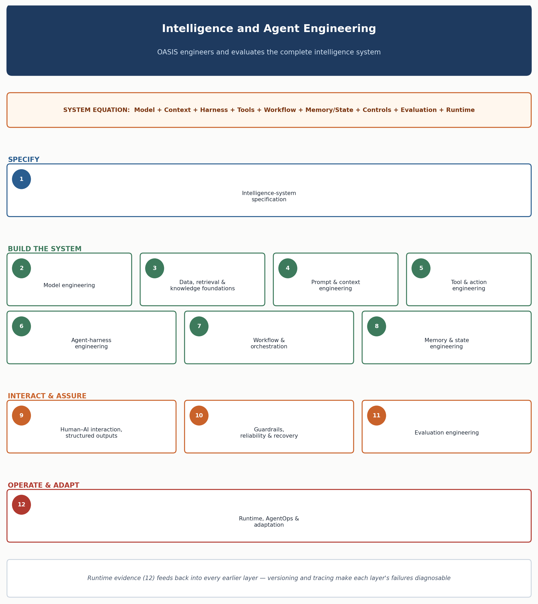

<!-- SPDX-License-Identifier: MIT -->

[← Previous: Part III: Intelligence-System Engineering and Assurance](part-iii-intelligence-system-engineering-and-assurance.md) · [Contents](../README.md) · [Next: Chapter 15: Data and Knowledge Engineering →](chapter-15-data-and-knowledge-engineering.md)

# Chapter 14: Intelligence and Agent Engineering

> **Implementation companion:** [Ageis](https://github.com/knowledgetrailsai/Ageis) — end-to-end agentic delivery practice. Model-architecture background: [Axiom](https://github.com/knowledgetrailsai/Axiom).

# Intelligence and Agent Engineering

> **CHAPTER PURPOSE** Engineer the complete intelligence system from specification and model strategy through context, harness, tools, memory, evaluation and AgentOps — as a single accountable engineering discipline, not a chain of independent experiments.

## Background and context

Early applied LLM work treated "prompt engineering" as the whole discipline: get the wording right, add examples, and the system behaves. That worked when a system was one call to one model.

It stopped working once systems began retrieving evidence, calling tools, running multi-step loops, remembering across sessions, and taking real-world actions. A well-worded prompt over poor retrieval, an unbounded agent loop, or an unmonitored tool with no rollback is not well-engineered — it is a good sentence in a fragile machine.

This chapter treats the whole machine as the unit of engineering. The equation below organizes the rest of Part III: an AI system is the sum of nine engineered layers, each with its own failure modes and design discipline.

> **SYSTEM EQUATION** AI system = Model + Context + Harness + Tools + Workflow + Memory/State + Controls + Evaluation + Runtime.

This shift also changes where confidence has to come from. [Chapter 13](chapter-13-decision-gates-and-evidence-model.md) established that lifecycle progression is gated on evidence, not calendar time or stakeholder comfort.

This chapter is where that evidence gets manufactured: Solution Viability, Production Readiness, and Operational Acceptance evidence are all claims about the twelve layers engineered here. A team that cannot answer "how was this specified, selected, evaluated and controlled" for each layer has no real evidence to bring to a gate.

[Chapter 15](chapter-15-data-and-knowledge-engineering.md) goes deep on Section 3 below — the governed services that supply evidence to the system — because knowledge quality is the single most common root cause of production failure.

Each section below states the discipline and why it matters, at methodology altitude. Templates, schemas, and worked examples live in the **engineering/** folder, this chapter's companion: [Model Engineering](../engineering/model-engineering.md), [Context and Retrieval Engineering](../engineering/context-and-retrieval-engineering.md), [Tool and Integration Interface Specification](../engineering/tool-and-integration-interface-specification.md), [Harness and Orchestration Engineering](../engineering/harness-and-orchestration-engineering.md), [Memory and State Engineering](../engineering/memory-and-state-engineering.md), and [Evaluation and Reliability Engineering](../engineering/evaluation-and-reliability-engineering.md). The [OASIS Reference Architecture](../architecture/oasis-reference-architecture.md) renders the equation above as a component diagram.

*Figure 4. OASIS engineers and evaluates the complete intelligence system.*

## 1. Intelligence-system specification

Every intelligence system needs a behavioral contract before it needs a model, a prompt, or a line of harness code. This section calls that contract the intelligence-system specification. It states what the system must understand, decide, generate or execute; what inputs and evidence it may use; the shape of its expected output; what actions it may and may not take; how it behaves under uncertainty, including when it must abstain; what "done" looks like; prohibited behavior; and cases that require a human's authority.

Write this down. Don't leave it implicit in a system prompt. A system prompt instructs the model alone. A specification is a contract the whole system — harness, tools, guardrails, evaluation — is built and evaluated against. Teams that skip this step discover the specification anyway, one incident at a time, as each unanticipated case forces an ad hoc decision. The [Intelligence-System Blueprint](chapter-32-templates-checklists-and-tools.md#11-intelligence-system-blueprint) carries it through design, build and evaluation; the [OASIS Reference Architecture](../architecture/oasis-reference-architecture.md#1-system-equation-as-a-diagram) shows where each element lands on the system diagram. Ageis's [spec-driven development practice](https://github.com/knowledgetrailsai/Ageis/blob/main/docs/practices/spec-driven-development.md) works the same discipline at the level of a single delivery task: write the spec first, and hold the build and its grading to it.

## 2. Model engineering

Model engineering means selecting and benchmarking models against representative tasks — not general leaderboards, and not reputation. The decision surface is wide: reasoning depth, modality, deployment region, data handling, latency, cost per successful outcome, context window, tool-call reliability, and provider realities like SLA and deprecation notice. No single dimension dominates — a model that wins on reasoning but cannot be deployed in the required region is not viable.

The order of optimization matters as much as the criteria. Prove the task is solvable with the strongest appropriate model first, to set a quality ceiling. Only then work downward: smaller models, difficulty-based routing, caching, context compression, or, last, fine-tuning. Skipping the ceiling step makes "the task is hard" indistinguishable from "the model is too weak," and cost pressure becomes an excuse to under-invest. The full framework is in [Model Engineering](../engineering/model-engineering.md).

## 3. Data, retrieval and knowledge foundations

An intelligence system is only as trustworthy as the evidence it reasons over, and that evidence must come from governed services, not ad hoc assembly per request. This covers discovering and ingesting sources, parsing and normalizing them, organizing them under a taxonomy with usable metadata, chunking without destroying structure, indexing, retrieving, keeping content fresh, tracing lineage, and enforcing access control at every step.

The governing principle: aim for the smallest sufficient and authoritative evidence set, not the largest possible context. As context windows grow, it's tempting to solve evidence problems by including more, trusting the model to sort it out. In practice, irrelevant evidence competes for attention, degrades reasoning over evidence that matters, and widens the surface for a poisoned document to influence behavior. Retrieval quality must be evaluated separately from generation quality — a convincing answer built on wrong evidence can hide a retrieval failure until it meets a case the evaluation set missed. Details are in [Context and Retrieval Engineering](../engineering/context-and-retrieval-engineering.md); [Chapter 15](chapter-15-data-and-knowledge-engineering.md) covers the governance lifecycle in full.

## 4. Prompt and context engineering

Prompt and context engineering are often treated as the same thing, but they differ in scope. Prompt engineering is fixed wording: what to do, what format to use, what examples to follow. Context engineering covers everything else at a decision point — task and workflow state, retrieved sources, memory, tool definitions and results, applicable policy, examples, and the token budget it all must fit. A carefully written prompt over a poorly assembled context still fails: the model reasons correctly over the wrong material. The failure looks like a model problem; it is a context problem.

Because context is assembled fresh at each decision point, it must be authorization-aware (a user never sees evidence through the model they couldn't see directly), source-attributed, fresh, able to compress gracefully rather than truncate silently, and resistant to poisoning — embedded instructions in a document are a documented failure class, not a hypothetical.

| **Context engineering**                                       | **Harness engineering**                                         |
|-----------------------------------------------------------------|-----------------------------------------------------------------|
| Determines what the model sees now.                            | Determines how the system completes the task.                  |
| Selects instructions, knowledge, memory and tool information.   | Runs loops, tools, state, retries, checkpoints and recovery.    |
| Manages relevance, ordering and token budget.                   | Manages execution limits, authority, escalation and completion. |
| Optimizes a decision point.                                     | Coordinates the end-to-end task lifecycle.                      |

When a bug report says "the agent got confused," ask which side of this table the failure sits on — the fix differs. The full context architecture template and checklist are in [Context and Retrieval Engineering](../engineering/context-and-retrieval-engineering.md). Ageis's [context-engineering practice](https://github.com/knowledgetrailsai/Ageis/blob/main/docs/practices/context-engineering.md) covers the same discipline for a coding agent: curate what it can see deliberately, instead of letting the context window fill by accident.

## 5. Tool and action engineering

A tool, here, is a governed interface through which the system retrieves information, performs a calculation, or acts in the world — not a raw API connection. A raw API assumes a human read the documentation before calling it; a tool exposed to a model must be narrow and unambiguous enough for the model to select correctly, and must assume adversarial input upstream can manipulate the caller's judgment.

A governable tool contract defines: purpose; inputs and outputs; how it authenticates and what it authorizes against (the requesting user and business context, not just the calling service's identity); data classification; input validation; idempotency; timeout and retry behavior; transaction boundaries; when it requires human confirmation; audit logging; rollback or compensation; and machine-readable failure output. Tools should be narrow enough that their blast radius is controlled and clear enough that a model reliably picks the right one. Details, a worked example, and integration guidance (including for protocols such as MCP) are in the [Tool and Integration Interface Specification](../engineering/tool-and-integration-interface-specification.md). Ageis's [tool/function-calling design practice](https://github.com/knowledgetrailsai/Ageis/blob/main/docs/practices/tool-function-calling-design.md) treats the same problem as API design: bad tool naming and schemas cause bad tool-calling behavior.

## 6. Agent-harness engineering

The harness is the software scaffold around the model that turns a single inference call into a working system. It assembles context at each decision point, invokes the model, calls tools, records state, validates results, enforces operating limits, pauses for human approval where required, retries safely, checkpoints long-running work, and terminates on explicit criteria rather than running out of steps.

Harness failure differs from model or context failure. A context failure produces a wrong answer to a well-posed question. A harness failure produces a system that never terminates, retries a non-idempotent action and duplicates its side effect, loses partial progress after a crash, or can't tell success from running out of iterations.

These are conventional distributed-systems failures needing conventional fixes — state machines, idempotency keys, checkpointing, circuit breakers — not a better prompt. Harness assumptions must be retested whenever the models, tools, or workflows underneath change. Details are in [Harness and Orchestration Engineering](../engineering/harness-and-orchestration-engineering.md). Ageis's [plan-then-execute practice](https://github.com/knowledgetrailsai/Ageis/blob/main/docs/practices/plan-then-execute.md) applies the same separation of thinking from doing: the agent proposes a plan, a human approves it, and only then does execution start.

## 7. Workflow and orchestration engineering

Not every task needs an agent. Orchestration engineering starts by choosing the least expensive pattern that fits, then justifying anything more elaborate. Use a deterministic function for a fixed calculation — faster, cheaper, and easier to test than any model-driven alternative. Use an explicit workflow when the path is known and enumerable, even if it branches. Reserve agents for open-ended tasks requiring dynamic choice. Reach for multi-agent systems only when specialization, isolation, or parallelism produces a measurable benefit, not because it sounds sophisticated. Unjustified escalation up this ladder is a cost, reliability, and testability regression, and should be an architecture-review finding.

Once a pattern is chosen, orchestration covers hand-offs: sequential steps, concurrent steps merged, routing to a specialized path, explicit hand-off between agents, a supervisor delegating to sub-agents, and human-in-the-loop steps as first-class nodes rather than bolted-on exceptions. Every pattern needs state that survives its own hand-offs, a named accountable owner per path, and a defined recovery behavior for partial failure.

The decision tree and implementation notes are in the [Reference Architecture's orchestration-pattern section](../architecture/oasis-reference-architecture.md#4-selecting-the-orchestration-pattern-ch-14-7-decision-rule) and in [Harness and Orchestration Engineering](../engineering/harness-and-orchestration-engineering.md). Ageis's [multi-agent orchestration practice](https://github.com/knowledgetrailsai/Ageis/blob/main/docs/practices/multi-agent-orchestration.md) shows the pattern at delivery-task scale: separate sub-agents for planning, coding, review and verification, including one agent whose job is to try to disprove another's output.

## 8. Memory and state engineering

State and memory are easy to conflate. State records the current execution — steps taken, artifacts produced, approvals granted, tool results, errors, transaction status — for the task in front of the system right now. Memory retains information that may inform future work, beyond this task's lifecycle. Quick test: if information becomes meaningless when the task ends, it's state; if it should matter next time this user, case, or system interacts with the agent, it's memory.

Memory needs the same governance any persistent store needs, and must not be equated with indefinite conversation storage. Keeping every conversation forever and letting the model search over it creates a permanent, unaudited store with no retention policy and no way to answer a correction or deletion request.

A properly engineered memory store defines, per category: purpose, source and confidence, who can access it, retention period, correction mechanism, expiry, and controls against contamination. A store with no correction mechanism will silently accumulate wrong memories that degrade every future decision reading from it. Details are in [Memory and State Engineering](../engineering/memory-and-state-engineering.md). Ageis's [memory/state persistence practice](https://github.com/knowledgetrailsai/Ageis/blob/main/docs/practices/memory-state-persistence.md) states the same rule plainly: persist only the facts the agent will actually need again.

## 9. Human–AI interaction, structured outputs and validation

How the system presents itself to a human, and hands off to another machine, are engineering problems, not interface polish added at the end. Human-facing interaction requires deliberately designing how evidence is presented, how uncertainty is communicated rather than hidden, how a proposed action is previewed, how approval and override are captured, how corrections feed back into the system, when it escalates rather than proceeds, and how feedback is collected and used.

Machine-consumed outputs need explicit schemas, deterministic parsing, and business-rule validation before anything downstream acts on them — "the model usually gets the format right" is not a strategy. For high-consequence decisions, the system should expose its sources and reasoning evidence directly rather than an unverifiable narrative explanation. A plausible-sounding justification is not a checkable one.

The [Human–AI Workflow Blueprint](chapter-32-templates-checklists-and-tools.md#7-human-ai-workflow-blueprint) carries this design through build and review; [Chapter 16](chapter-16-human-ai-workflow-and-experience-engineering.md) treats the interaction design in full depth. Ageis's [human-in-the-loop gating practice](https://github.com/knowledgetrailsai/Ageis/blob/main/docs/practices/human-in-the-loop-gating.md) names the same checkpoint pattern: irreversible actions require explicit human confirmation, even when the agent is otherwise autonomous.

## 10. Guardrails, reliability and recovery

No single control catches every failure, so guardrails are layered: input, context, model, tool, workflow, output, runtime, and business policy each carry their own controls, so a failure past one layer is caught by another. Operating limits — iteration, time, token, cost, transaction — bound behavior in absolute terms. Recovery behaviors handle failure anyway: safe retries limited to idempotent operations, explicit handling of partial completion, compensating actions for anything irreversible, fallback to a simpler model or workflow, a clear trigger for human escalation, and, at the outer edge, suspension and kill switches.

None of this is optional hardening bolted on after a system works — it's what makes autonomous operation defensible. Strong guardrails without evaluation coverage give no way to know what's actually being protected against. Details are in [Evaluation and Reliability Engineering](../engineering/evaluation-and-reliability-engineering.md#3-guardrails-and-recovery-pattern-library) and the [security threat and control checklist](../security/agentic-ai-threat-and-control-checklist.md).

## 11. Evaluation engineering

Evaluation is how a team knows, with evidence rather than confidence, that a system behaves acceptably, and it must measure at more altitudes than a single response. This chapter names fifteen dimensions: intent understanding, correctness, groundedness, citation accuracy, structured-output validity, retrieval quality, tool selection and argument correctness, workflow completion, policy adherence, escalation correctness, robustness under adversarial input, latency, cost, user acceptance measured by behavior, and outcome contribution — whether the system moves the business metric it was built for.

That last dimension is why evaluation must progress through units. A single model response can be graded in isolation; a single agent step in context of the task so far; a completed workflow end to end; production behavior against the actual outcome metric. Testing only at the response level gives no evidence the system works end to end, since correct steps don't automatically compose into a correct outcome. Measuring only at the outcome level tells you something broke, not what.

Coverage at every level turns evaluation from a demo check into a production instrument. Details are in [Evaluation and Reliability Engineering](../engineering/evaluation-and-reliability-engineering.md). Ageis's [evals practice](https://github.com/knowledgetrailsai/Ageis/blob/main/docs/practices/evals.md) applies the same discipline to a coding agent: test suites for agent *behavior*, run in CI, gating prompt and agent changes before they ship.

## 12. Runtime, AgentOps and adaptation

Once a system is live, engineering shifts to versioning, tracing, and disciplined diagnosis. Every component that can change — models, prompts, context policies, retrieval indexes, tools, workflows, controls — needs independent versioning, because "what changed" is the first question of any incident. A system that can't answer it precisely turns every incident into an investigation.

Tracing has to cover model and tool calls, decisions, approvals, and outcome events, so a failure can be diagnosed at the layer actually responsible, rather than whichever is easiest to blame. Ageis's [prompt and agent versioning practice](https://github.com/knowledgetrailsai/Ageis/blob/main/docs/practices/prompt-agent-versioning.md) treats prompts, system instructions and tool configs the same way as code: versioned, diffed, reviewed and rolled back, because a prompt change can matter as much as a code change.

Fine-tuning belongs at the end of this list deliberately: only when a failure is repeated, well-defined, and specific to the model's domain knowledge or behavior, and only after context, workflow, tool, and instruction improvements have already failed to close the gap. It is not the default repair for every quality issue; treating it as one produces an expensive, slow fix for a problem a cheaper change would have solved. The [Model Engineering](../engineering/model-engineering.md#5-fine-tuning-decision-checklist) fine-tuning checklist operationalizes this ordering; the [Monitoring specification](../monitoring/observability-and-telemetry-specification.md) defines the trace and version record every runtime event should carry.

## Engineering artifact set

| **Artifact**                        | **Decision supported**                                                 | **Companion document** |
|--------------------------------------|--------------------------------------------------------------------------|--------------------------|
| Intelligence Specification          | What behavior and authority are required?                              | [Intelligence-System Blueprint](chapter-32-templates-checklists-and-tools.md#11-intelligence-system-blueprint) (Ch. 32, item 11) |
| Model Strategy and Benchmark        | Which model or route meets thresholds?                                 | [Model Engineering](../engineering/model-engineering.md) — selection criteria, benchmark record, routing design |
| Context Architecture                | What evidence and state are supplied at each decision?                 | [Context and Retrieval Engineering](../engineering/context-and-retrieval-engineering.md) — context architecture template |
| Tool Catalogue and Action Contracts | What can the system access or execute, under what controls?            | [Tool and Integration Interface Specification](../engineering/tool-and-integration-interface-specification.md) — tool contract template |
| Harness and Workflow Design         | How does the task progress, recover and terminate?                     | [Harness and Orchestration Engineering](../engineering/harness-and-orchestration-engineering.md) — responsibility checklist and state machine |
| Memory and State Policy             | What persists, for whom, for how long and with what correction rights? | [Memory and State Engineering](../engineering/memory-and-state-engineering.md) — classification table and policy template |
| Evaluation and Regression Suite     | What constitutes acceptable behavior and change?                       | [Evaluation and Reliability Engineering](../engineering/evaluation-and-reliability-engineering.md); [Evaluation Strategy and Dataset](chapter-32-templates-checklists-and-tools.md#9-evaluation-strategy-and-dataset) (Ch. 32, item 9) |
| AgentOps Runbook                    | How is the system deployed, observed, supported and improved?          | [Monitoring: Observability and Telemetry Specification](../monitoring/observability-and-telemetry-specification.md); [Service Runbook](chapter-32-templates-checklists-and-tools.md#16-service-runbook) (Ch. 32, item 16) |

---

[← Previous: Part III: Intelligence-System Engineering and Assurance](part-iii-intelligence-system-engineering-and-assurance.md) · [Contents](../README.md) · [Next: Chapter 15: Data and Knowledge Engineering →](chapter-15-data-and-knowledge-engineering.md)

© 2026 OASIS Methodology contributors. Licensed under the [MIT License](../LICENSE.md).
