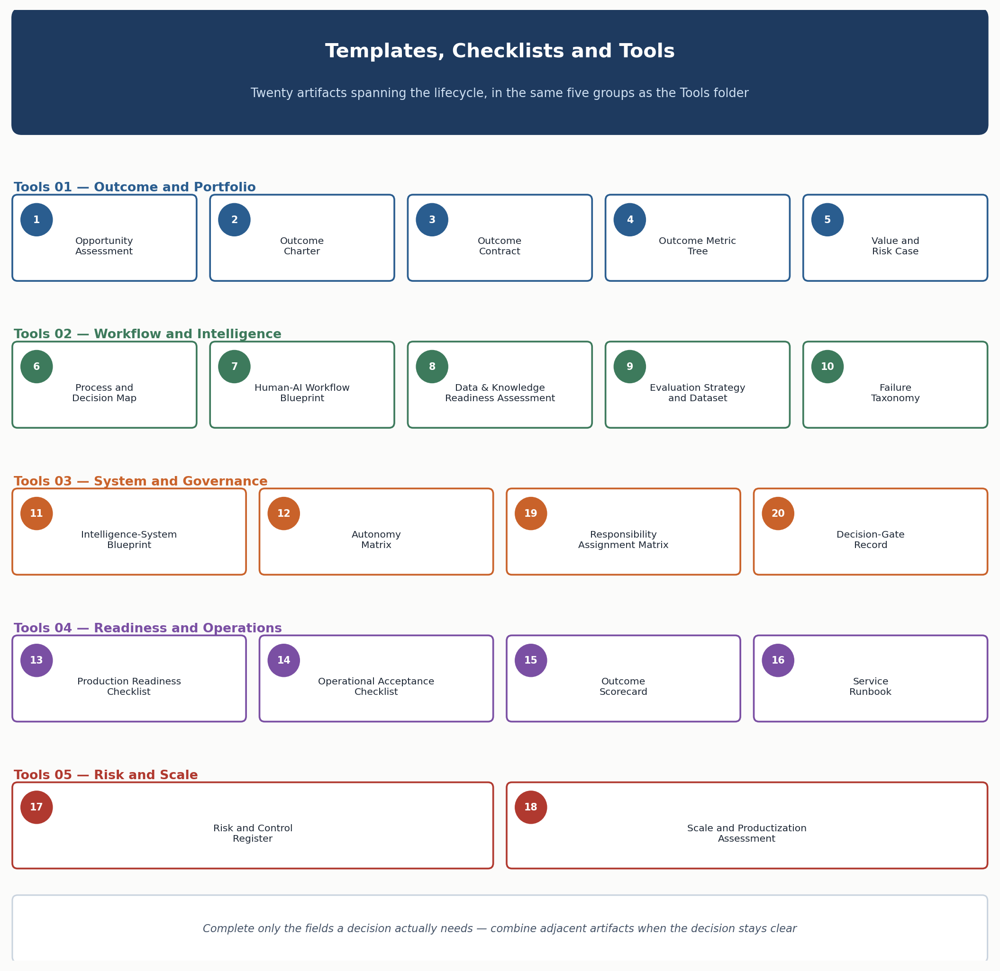

<!-- SPDX-License-Identifier: MIT -->

[← Previous: Chapter 31: Illustrative Use Cases](chapter-31-illustrative-use-cases.md) · [Contents](../README.md) · [Next: Chapter 33: Appendices and Reference Material →](chapter-33-appendices-and-reference-material.md)

# Chapter 32: Templates, Checklists and Tools

# Templates, Checklists and Tools

> **CHAPTER PURPOSE** Provide a practical artifact toolkit for teams to frame outcomes, design systems, evaluate quality, govern risk and operate services — twenty artifacts spanning the full lifecycle, each named here at the level of what it must capture and why, with its fillable working version held in the companion Tools folder.

## Background and context

Every chapter from 5 through 30 has, at some point, pointed at an artifact without fully specifying it — an outcome charter mentioned in Chapter 7, an autonomy matrix referenced in Chapter 10, a risk register invoked repeatedly from Chapter 20 onward. This chapter is where those scattered references converge into a single, numbered catalogue. A methodology that only describes decisions in prose, without naming the artifact that records each one, relies on every team reconstructing its own paperwork from memory — and that is exactly where consistency and auditability break down. Chapter 31 touched most of these twenty templates across its eight use cases; this chapter defines each one independently, so it applies consistently across all of them.

The relationship between this chapter and the [Tools](../tools/01-outcome-and-portfolio-templates.md) folder is worth stating once. Each numbered section here answers *what* the artifact is, *why* it exists as a distinct decision-support instrument, and *what a strong instance demonstrates versus what a weak one misses*. The Tools folder — five files, `01` through `05`, each covering four or five templates in the same order as here — turns that definition into something a team opens on day one and fills in: YAML schemas, tables with named columns, and worked examples of what "good" looks like. Chapter 32 is the map; Tools is the vehicle. A reader wanting to understand why the Autonomy Matrix exists should read section 12 below; a reader actually building one should have [Tools: System and Governance Templates](../tools/03-system-and-governance-templates.md) open instead. Each section links directly to its fillable counterpart.

Two things make this chapter load-bearing for the rest of the repository. First, more external files link into its numbered headings by exact anchor than into any other chapter — architecture perspectives, standards checklists, the security threat model, and the monitoring specification all cite specific templates by number. The heading text and numbering below are fixed and must never be renumbered, reordered, or merged. Second, the toolkit is intentionally modular: teams may combine adjacent artifacts — folding a Value and Risk Case into an Outcome Charter for a low-risk initiative, say — whenever the result still supports a clear decision. The [Template use rule](#template-use-rule) at the end of this chapter keeps that flexibility from tipping into bureaucratic bloat or artifact-skipping. Each template below states its minimum useful content, the decision it supports, what separates a strong instance from a weak one, and where to find the working version.

*Figure 12. Twenty artifacts, five template files, one lifecycle.*

## 1. Opportunity Assessment

The Opportunity Assessment is the first artifact almost any initiative produces. Its job is narrow: decide whether a candidate problem is worth taking further before anyone commits engineering time. At minimum it captures the problem statement, the affected workflow, the outcome an intervention would target, whether baseline data exists, the stakeholders involved, an early read on intelligence-fit, known dependencies, early risk flags, the transformation horizon, and a recommendation — proceed, park, or decline.

What separates a useful assessment from a weak one is honesty about uncertainty. A strong assessment says plainly when baseline data does not exist yet, flags a weak intelligence-fit when a simpler deterministic fix would do, and recommends "decline" or "park" as often as "proceed" — an intake process where everything gets approved is not screening anything. Skipping or rushing this step is how a project reaches Phase 2 discovery before anyone confirms the problem is real, measurable, and actually suited to an intelligence-system approach. Complete it against [Chapter 5 — Opportunity Portfolio and Transformation Horizons](chapter-05-opportunity-portfolio-and-transformation-horizons.md), at the entry point of [Chapter 7 — Phase 1: Engage & Align](chapter-07-phase-1-engage-and-align.md). The fillable version is [Tools: Opportunity Assessment](../tools/01-outcome-and-portfolio-templates.md#1-opportunity-assessment).

## 2. Outcome Charter

Where the Opportunity Assessment asks whether to proceed, the Outcome Charter is what a team commits to once the answer is yes. It states the outcome in one sentence, defines the population in scope, records baseline and target values, articulates the causal hypothesis — why this intervention should move this metric, not just correlate with it — and sets scope, exclusions, a single accountable owner, guardrail metrics that must not regress, a timeline, and the next decision gate.

The causal hypothesis field is the one most often left blank, and its absence is the clearest sign of a charter written to satisfy a process step rather than guide a build. A charter that cannot say *why* the intervention should move the metric has not earned the engineering resources behind it. Owner ambiguity is the second common failure: a charter with no single accountable name tends to become everyone's charter and no one's. See [Chapter 3 — Enterprise AI Transformation Direction](chapter-03-enterprise-ai-transformation-direction.md) and [Chapter 7 — Phase 1: Engage & Align](chapter-07-phase-1-engage-and-align.md) for the charter's place in the lifecycle, and [Tools: Outcome Charter](../tools/01-outcome-and-portfolio-templates.md#2-outcome-charter) for the fillable schema.

## 3. Outcome Contract

The Outcome Contract extends the charter into an operating agreement between the party accountable for delivering the outcome and the business that owns it. It carries everything the charter carries, plus explicit service responsibilities on both sides, how measurement works in practice, the data sources it depends on, a review cadence, remedies if a target is missed or a guardrail breached, the funding model, and the conditions for renewal or ending.

A charter can exist in a planning document; a contract has to survive an actual operating relationship, which is why it needs remedies and renewal terms the charter does not. This artifact guards against an outcome that quietly becomes permanent without anyone revisiting whether it is still worth funding, and against a missed target with no agreed consequence. A contract with no exit condition is a commitment nobody can responsibly walk back from. See the outcome-contract concept in [Chapter 1 — OASIS Executive Overview](chapter-01-oasis-executive-overview.md) and its use during [Chapter 8 — Phase 2: Discover & Validate](chapter-08-phase-2-discover-and-validate.md). The fillable version is [Tools: Outcome Contract](../tools/01-outcome-and-portfolio-templates.md#3-outcome-contract).

## 4. Outcome Metric Tree

The Outcome Metric Tree connects a single primary outcome to the leading indicators that predict it, the operational drivers that produce those indicators day to day, and the guardrails that catch unacceptable side effects — each with a precise definition, a named data source, the segmentation that matters, and a threshold that triggers attention.

A metric tree with a primary outcome but no leading indicators is a lagging-only system: it tells a team whether it succeeded, weeks later, with no earlier signal to act on. A tree with no guardrail row is worse — nobody has committed to watching for how this system could cause harm while pursuing its target, an omission the [Autonomy Matrix](#12-autonomy-matrix) later relies on having been avoided. Defining each metric precisely, rather than gesturing at a concept, is what makes the [Outcome Scorecard](#15-outcome-scorecard) reviewable months later without a debate over what a number means. Build this against [Chapter 26 — OASIS Measurement Framework](chapter-26-oasis-measurement-framework.md); the fillable table is [Tools: Outcome Metric Tree](../tools/01-outcome-and-portfolio-templates.md#4-outcome-metric-tree).

## 5. Value and Risk Case

The Value and Risk Case sits alongside the Outcome Charter as the artifact that makes the investment decision defensible on economic and risk terms. It captures quantified and qualitative benefits, the full cost picture across build, run, human intervention, and expected failure cost, an honest statement of uncertainty and its assumptions, a risk classification across impact, autonomy, data sensitivity, and exposure, a reversibility assessment, planned mitigations, and a net recommendation.

A serious Value and Risk Case includes intervention cost and failure cost as real line items, not afterthoughts — a benefit case that assumes zero human oversight time and zero failure cost has almost certainly understated both. The classic failure this artifact prevents is the project greenlit purely on upside, with a risk section filled in only after the funding decision was made — documentation theater rather than an input to the decision. Pair this with the risk-classification approach in [Chapter 20 — Governance, Compliance and Regulatory Engineering](chapter-20-governance-compliance-and-regulatory-engineering.md) and the unit-economics framing in [Chapter 22 — Economics, FinOps and Sustainability](chapter-22-economics-finops-and-sustainability.md). The fillable schema is [Tools: Value and Risk Case](../tools/01-outcome-and-portfolio-templates.md#5-value-and-risk-case).

## 6. Process and Decision Map

The Process and Decision Map records how a workflow actually operates today — not the target state, the reality — step by step: which actor performs each step, which systems it touches, what input feeds it, what decision gets made and under what rule or policy, what evidence supports that decision, where work queues or hands off, how exceptions are handled, where the pain points are, and which steps constitute an outcome event worth measuring.

Teams under schedule pressure are tempted to skip straight to designing the target workflow; this artifact resists that. A map built from what people say the process is, rather than what actually happens including undocumented exceptions and workarounds, produces a design that fails the moment it meets a case type nobody mentioned. The map is also where the earliest signal of automation-worthiness appears — a step with a clear rule, reliable evidence, and high volume is a better automation candidate than one buried in tribal knowledge, however more impressive the latter looks to automate. Build this during [Chapter 8 — Phase 2: Discover & Validate](chapter-08-phase-2-discover-and-validate.md); the fillable table is [Tools: Process and Decision Map](../tools/02-workflow-and-intelligence-templates.md#6-process-and-decision-map).

## 7. Human-AI Workflow Blueprint

The Human–AI Workflow Blueprint is where the process map above becomes a design: for each step, it states what the AI does, what the human does, who holds authority to decide or act, what evidence the human sees, the interface through which the interaction happens, whether approval is required before an action executes, how a human overrides the output, what happens if the AI is unavailable, what triggers escalation and to whom, how corrections feed back into evaluation, and what marks the workflow complete.

The blueprint's most consequential field is authority — whether the AI acts, whether it recommends and a human decides, or whether the human acts with AI assistance. A common failure is leaving this field implicit, so the system ends up with more authority than anyone formally granted, simply because no one built a fallback path for timely human intervention. An equally common failure is a well-designed AI role with no feedback-loop field filled in, so every correction a human makes evaporates instead of improving the system. This blueprint is the direct design output of [Chapter 16 — Human–AI Workflow and Experience Engineering](chapter-16-human-ai-workflow-and-experience-engineering.md); its fillable YAML schema, including the feedback-loop link into template 9, is [Tools: Human–AI Workflow Blueprint](../tools/02-workflow-and-intelligence-templates.md#7-human-ai-workflow-blueprint).

## 8. Data and Knowledge Readiness Assessment

This assessment inventories every data and knowledge source an intelligence system will draw on, recording for each its owner, whether it is authoritative, a quality score, known coverage gaps, freshness, metadata availability, access controls, lineage documentation, retention policy, and current operational status.

The discipline this artifact enforces is scoring each source against the specific decision it will support, not in the abstract — a source excellent for a quarterly business report can still be unfit as retrieval evidence for a customer-facing answer if it carries no source attribution a citation mechanism can point to. Skipping or rushing this assessment is a common root cause in production incident reviews: a knowledge assistant hallucinating policy, or an extraction system silently degrading, both frequently trace back to a source whose freshness or authority was never verified before it was wired in. This work belongs to [Chapter 15 — Data and Knowledge Engineering](chapter-15-data-and-knowledge-engineering.md), and connects to [Architecture: Information and Knowledge Architecture](../architecture/perspective-04-information-and-knowledge-architecture.md). The fillable table is [Tools: Data and Knowledge Readiness Assessment](../tools/02-workflow-and-intelligence-templates.md#8-data-and-knowledge-readiness-assessment).

## 9. Evaluation Strategy and Dataset

The Evaluation Strategy and Dataset defines what "good" means for a system before it is judged against that standard: the quality dimensions in scope — correctness, groundedness, citation accuracy, retrieval quality, tool-selection accuracy, workflow completion, policy adherence, robustness, latency, cost, and outcome contribution among others — the case dataset and its sources, the split between development, held-out, and regression cases, expected behavior per case, the grading method, pass thresholds, a regression policy, and a production-sampling plan.

The clearest sign of a mature evaluation strategy is a regression policy that actually gets used: every production failure becomes a new case, so the system cannot repeat the same mistake unnoticed. The most damaging failure is the opposite — an evaluation set built once before launch and never updated, drifting further from the real production distribution every month, quietly making a passing score less meaningful. Groundedness deserves particular attention: a system can be fluent and confident while ungrounded in its actual sources, and only a deliberately designed evaluation dimension catches that before a user does. This strategy is the operational core of [Chapter 18 — Evaluation and Reliability Engineering](chapter-18-evaluation-and-reliability-engineering.md); the fillable schema, including the full quality-dimension list, is [Tools: Evaluation Strategy and Dataset](../tools/02-workflow-and-intelligence-templates.md#9-evaluation-strategy-and-dataset).

## 10. Failure Taxonomy

The Failure Taxonomy classifies how a system fails, not just that it failed: each entry records the failure family, its responsible layer, severity, detectability, root cause, the evidence that surfaced it, business impact, an owner, the containment action taken, the correction applied, and whether a regression case was added.

Classifying by responsible layer — model, context, retrieval, tool selection, tool execution, state, workflow, policy, human approval, or enterprise dependency — before root-causing a failure prevents teams from reflexively blaming the model for what was actually a context-assembly or tool-contract defect. A taxonomy populated only after the fact, treated as an incident log rather than a living classification consulted during design, misses its real purpose: informing which layer needs hardening before the next system launches with the same architecture. Chapter 21's incident classification model and the [Monitoring specification's incident taxonomy](../monitoring/observability-and-telemetry-specification.md#4-incident-classification-responsible-layer-taxonomy) share this same responsible-layer structure deliberately, so a failure classified here is classified the same way operationally. The fillable table is [Tools: Failure Taxonomy](../tools/02-workflow-and-intelligence-templates.md#10-failure-taxonomy).

## 11. Intelligence-System Blueprint

The Intelligence-System Blueprint is the architectural specification of a single system: its boundary and what is explicitly out of scope, the human roles and upstream/downstream systems it interacts with, its primary and fallback models and the routing criteria between them, the context sources feeding it and how context is assembled within a token budget, its knowledge indexes and freshness policy, its tool contracts, its workflow pattern — deterministic function, explicit workflow, single agent, or multi-agent — and the rationale for that choice, what it holds in memory and state and under what retention and correction rights, the guardrail layers implemented, the telemetry fields captured at runtime, and its dependencies.

The workflow-pattern rationale field deserves weight: choosing agent or multi-agent architecture has real consequences for evaluation difficulty, cost, and failure-mode surface area. A blueprint that picks the most sophisticated pattern available without a documented reason why a simpler deterministic workflow would not suffice has usually optimized for an interesting build over a reliable one. A blueprint with every other section complete but no controls or telemetry section will be hard to operate safely in production, however well it performs in a demo, because nobody will see what it actually did after the fact. Structure this using [Chapter 14 — Intelligence and Agent Engineering](chapter-14-intelligence-and-agent-engineering.md) and the component map in [Architecture: OASIS Reference Architecture](../architecture/oasis-reference-architecture.md#2-component-to-artifact-map). The fillable YAML schema is [Tools: Intelligence-System Blueprint](../tools/03-system-and-governance-templates.md#11-intelligence-system-blueprint).

## 12. Autonomy Matrix

The Autonomy Matrix is where authority gets made explicit, action by action: for each distinct action a system can take, it records the case class, the risk level, the system's currently evidenced capability, the human authority required, the operating limits in force, the evidence threshold to progress to greater autonomy, what triggers escalation, and what triggers suspension.

What separates a genuine autonomy matrix from a superficial one is granularity at the level of the action, not the system. An agent that both drafts customer replies and issues refunds needs two separate rows, because the evidence required to trust drafting has nothing to do with the evidence required to trust the movement of money — collapsing them into one system-wide rating is how a system ends up authorized to do something risky on evidence that only ever validated something safe. Progression from one autonomy mode to the next — shadow, assisted, supervised, bounded-autonomous, and beyond — should always be evidenced per row, never granted as a blanket promotion because the system "seems to be working." This is where an autonomy ceiling is set and defended: the maximum authority a given action may carry until new evidence justifies raising it. See [Chapter 10 — Phase 4: Activate & Adopt](chapter-10-phase-4-activate-and-adopt.md) and the progressive-autonomy modes in [Chapter 16](chapter-16-human-ai-workflow-and-experience-engineering.md). The fillable table is [Tools: Autonomy Matrix](../tools/03-system-and-governance-templates.md#12-autonomy-matrix).

## 13. Production Readiness Checklist

The Production Readiness Checklist confirms a system is safe to expose to live users before it happens: architecture reviewed, security checklist items complete, privacy obligations addressed, evaluation thresholds met, integrations tested, resilience behavior (timeouts, retries, idempotency, compensation) verified, monitoring instrumented across every operational plane, support ownership defined, a runbook in place, rollback criteria documented, and named approvers signed off.

This checklist answers a narrower question than it first appears to: not "does this system work," but "is it safe to let real users touch it." A system can pass every readiness item and still fail the very next checklist — [Operational Acceptance](#14-operational-acceptance-checklist) — once actual usage begins. Treating readiness as the final gate rather than a necessary-but-insufficient one is a recurring source of launches that looked done and were not. The item to never skip is rollback criteria: a team that has not decided in advance what triggers a rollback versus a forward fix will make that decision under incident pressure, the worst time to make it well. Its source disciplines are [Chapter 9 — Phase 3: Engineer & Integrate](chapter-09-phase-3-engineer-and-integrate.md) and [Chapter 21 — Deployment, Operations and AgentOps](chapter-21-deployment-operations-and-agentops.md), with release-manifest evidence drawn from the [Monitoring specification](../monitoring/observability-and-telemetry-specification.md#3-release-manifest-checklist). The fillable checklist, with each of the eleven areas as a row, is [Tools: Production Readiness Checklist](../tools/04-readiness-and-operations-templates.md#13-production-readiness-checklist).

## 14. Operational Acceptance Checklist

Where the Production Readiness Checklist confirms a system is safe to launch, the Operational Acceptance Checklist confirms it is actually working once live users have touched it: how many users have been onboarded, the task completion rate, quality against evaluation thresholds, guardrail or control breaches since launch, adoption rate, whether the fallback path has actually been exercised rather than just documented, incidents since launch, whether user training is complete, whether a named service owner is in place, and the operating authority accepted per the Autonomy Matrix.

Keeping this a distinct gate from production readiness is deliberate: a technically sound system can still fail to deliver its outcome once real users interact with it in ways a test environment never exercised, and conflating the two gates hides that failure until it becomes expensive to unwind. The fallback-path item is worth calling out: a fallback only ever designed, never exercised in a live-fire test, is not yet working — it is a plan. This checklist operationalizes [Chapter 10 — Phase 4: Activate & Adopt](chapter-10-phase-4-activate-and-adopt.md). The fillable checklist is [Tools: Operational Acceptance Checklist](../tools/04-readiness-and-operations-templates.md#14-operational-acceptance-checklist).

## 15. Outcome Scorecard

The Outcome Scorecard is the recurring, dated snapshot of how a system is performing across seven dimensions — outcome, adoption, intelligence quality, risk, service health, economics, and reuse — each with a current value, a threshold or target, a trend, commentary, and an action where one is warranted.

A scorecard is only doing its job if it periodically produces an action — a change to make, an escalation to raise, a threshold to revisit. No action entries across two consecutive reviews is a warning sign worth taking seriously: either the system performs so consistently well that even its guardrails never approach their thresholds, which is possible but should be verified, or the scorecard has quietly become an archived artifact nobody uses to make decisions. Review it at the cadence set in [Chapter 27 — Delivery Cadence and Management Practices](chapter-27-delivery-cadence-and-management-practices.md), against the framework in [Chapter 26 — OASIS Measurement Framework](chapter-26-oasis-measurement-framework.md). The fillable table, with the seven dimensions as rows, is [Tools: Outcome Scorecard](../tools/04-readiness-and-operations-templates.md#15-outcome-scorecard).

## 16. Service Runbook

The Service Runbook is what an operations team opens at 2 a.m. when something has gone wrong: the service's purpose, its upstream and downstream dependencies, its dashboards, its alerts and their triggers and severities, a triage guide, its fallback path, kill-switch ownership and activation method, its escalation chain, a recovery procedure, a log of recent changes, named contacts, and its evidence-retention policy.

A runbook's value is inversely proportional to how much context it assumes the reader already has — the best runbooks are usable by someone who did not build the system, under time pressure, without paging the original engineer. The kill-switch fields deserve special attention: an emergency control that has never been tested, or whose activation method depends on the one engineer on vacation during the incident, is not a functioning kill switch, it is an assumption. This runbook is the connective artifact between [Chapter 21 — Deployment, Operations and AgentOps](chapter-21-deployment-operations-and-agentops.md) and the containment-and-emergency-control guidance in [Chapter 19](chapter-19-security-and-responsible-ai-engineering.md#containment-and-emergency-control). The fillable YAML schema is [Tools: Service Runbook](../tools/04-readiness-and-operations-templates.md#16-service-runbook).

## 17. Risk and Control Register

The Risk and Control Register is the single running record of every identified risk associated with a system: its description, cause, impact, inherent rating before controls, the controls actually in place, how those controls are tested, the residual rating after controls, an owner, the treatment decision — mitigate, transfer, avoid, or accept — supporting evidence, and the date it was last reviewed.

This register is deliberately the single most cross-referenced artifact in the toolkit: nearly every framework-specific checklist in [Standards](../standards/) and the [Security: Agentic AI Threat Model and Control Checklist](../security/agentic-ai-threat-and-control-checklist.md) points back to it rather than maintaining a parallel risk log. A risk described once here and cross-referenced from five checklists survives audits, framework updates, and staff turnover far better than the same risk independently re-described five times, each slightly out of sync. When a risk originates from a specific framework clause, noting the source — an EU AI Act article number, an OWASP category — in the description or cause field keeps that cross-reference traceable in both directions. This register is the working instrument for the risk method in [Chapter 20 — Governance, Compliance and Regulatory Engineering](chapter-20-governance-compliance-and-regulatory-engineering.md). The fillable table is [Tools: Risk and Control Register](../tools/05-risk-and-scale-templates.md#17-risk-and-control-register).

## 18. Scale and Productization Assessment

The Scale and Productization Assessment asks whether a capability built for one use case should become a shared, supported platform asset: current and pipeline demand, how much variance exists across consumers versus what stays fixed, interface stability, what is configurable versus what requires custom build, the tenancy model, the support model and its service levels, unit economics at current and target scale, concentration risk and blast radius if a shared component fails, and a roadmap decision — keep bespoke, productize, or retire.

The riskiest mistake this assessment prevents is productizing too early, on enthusiasm rather than evidence of repeat demand and interface stability — a component turned into a shared platform asset before its contract has stabilized tends to break every consumer at once the first time it needs to change. The opposite mistake, treating an obviously reusable component as permanently bespoke because nobody noticed the pattern, is just as costly in duplicated engineering effort over time. Blast radius deserves emphasis because productization changes it: a bespoke component's failure affects one system, a shared component's failure affects every consumer simultaneously, and that tradeoff belongs in the roadmap decision explicitly rather than being discovered during the first shared-component incident. This assessment operationalizes [Chapter 28 — Scaling and Productization](chapter-28-scaling-and-productization.md). The fillable YAML schema is [Tools: Scale and Productization Assessment](../tools/05-risk-and-scale-templates.md#18-scale-and-productization-assessment).

## 19. Responsibility Assignment Matrix

The Responsibility Assignment Matrix maps each significant activity and decision — outcome-charter sign-off, risk classification, decision-gate pass or fail, production-release approval, autonomy-mode promotion, kill-switch activation, incident-severity classification, and any others the engagement's decision inventory requires — to the roles that are accountable, responsible, consulted, and informed for it.

The rule that makes this matrix work is that exactly one name sits under Accountable for each row. Two names under Accountable is not extra coverage, it is an unresolved row: when something goes wrong under joint accountability, both parties can reasonably believe the other one was covering it. This matrix turns the operating-model and governance-forum design in [Chapter 6 — OASIS Operating Model and Decision Rights](chapter-06-oasis-operating-model-and-decision-rights.md) and [Chapter 24 — Roles, Teams and Governance Forums](chapter-24-roles-teams-and-governance-forums.md) into something checkable against a specific engagement's actual roster, rather than an org-chart abstraction. The fillable table, pre-populated with the decisions most engagements need to assign, is [Tools: Responsibility Assignment Matrix](../tools/03-system-and-governance-templates.md#19-responsibility-assignment-matrix).

## 20. Decision-Gate Record

The Decision-Gate Record documents a single gate passage: the decision reached — pass, pass with conditions, hold, or fail — the evidence actually reviewed and a summary of each artifact, the alternatives considered, any conditions attached to a conditional pass, the residual risk accepted and by whom, an owner, a due date for any conditions, an expiry date by which the decision must be revisited regardless of outcome, and follow-up actions.

A six-phase engagement produces at minimum six of these records, one per gate passage; treating the record as a per-project artifact rather than a per-gate one is a common way this template gets under-used. The expiry field is the one most often left blank, and its absence is how a conditional pass or a hold quietly becomes permanent — nobody circles back, the conditions are never met, and the gate's intent to require follow-through evaporates. This record is the working instrument for [Chapter 13 — Decision Gates and Evidence Model](chapter-13-decision-gates-and-evidence-model.md), and its evidence-gate discipline — a decision is only as good as the evidence actually reviewed when it was made, not the evidence that could theoretically have been gathered — runs through every other template in this chapter. The fillable YAML schema is [Tools: Decision-Gate Record](../tools/03-system-and-governance-templates.md#20-decision-gate-record).

## Template use rule

> **PRACTICALITY** Start with the decision to be made. Complete only the fields required to make, evidence and revisit that decision.

This rule exists because a toolkit of twenty named artifacts, taken literally as twenty mandatory documents per engagement, would produce exactly the bureaucratic drag OASIS is designed to avoid. The templates are decision-support instruments, not compliance paperwork completed for its own sake. The test for whether a field belongs in a given team's version of an artifact is whether leaving it blank would leave the underlying decision unmade, unevidenced, or unrevisitable. Two adjacent artifacts can be combined into one document when the decision they jointly support remains clear — a Value and Risk Case folded into an Outcome Charter for a low-risk, low-autonomy initiative is often the right call, while the same combination would understate the risk picture for a high-autonomy, customer-facing system and should stay separate there. This is also, deliberately, the anti-bureaucracy test that [Chapter 13](chapter-13-decision-gates-and-evidence-model.md) applies to the gate model as a whole: more paperwork is not more assurance, and a template filled out to satisfy a checklist rather than inform an actual decision has failed at its one job, regardless of how complete it looks. Apply this rule at the start of every artifact, not as an afterthought once a document already feels too long to finish.

---

[← Previous: Chapter 31: Illustrative Use Cases](chapter-31-illustrative-use-cases.md) · [Contents](../README.md) · [Next: Chapter 33: Appendices and Reference Material →](chapter-33-appendices-and-reference-material.md)

© 2026 OASIS Methodology contributors. Licensed under the [MIT License](../LICENSE.md).
