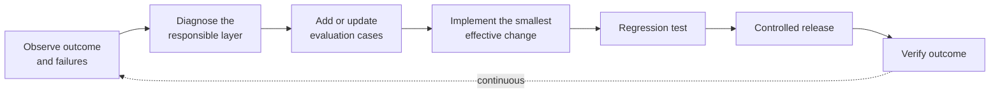

<!-- SPDX-License-Identifier: MIT -->

[← Back to Contents](../README.md) · [Chapter 21: Deployment, Operations and AgentOps](../methodology/chapter-21-deployment-operations-and-agentops.md) · [Engineering: Tool and Integration Interface Specification](../engineering/tool-and-integration-interface-specification.md) · [Architecture: Reference Architecture](../architecture/oasis-reference-architecture.md)

# Monitoring: Observability and Telemetry Specification

> **PURPOSE** Turn Chapter 21's operational-plane table into a concrete telemetry, dashboard and alerting specification a delivery team can implement, rather than a narrative description of what "AgentOps" should measure. Populate the metric definitions per system before go-live, as part of the [Production Readiness Checklist](../methodology/chapter-32-templates-checklists-and-tools.md#13-production-readiness-checklist).

**Primary OASIS source:** [Chapter 21 — Deployment, Operations and AgentOps](../methodology/chapter-21-deployment-operations-and-agentops.md); [Chapter 14 §12 — Runtime, AgentOps and Adaptation](../methodology/chapter-14-intelligence-and-agent-engineering.md); [Chapter 26 — OASIS Measurement Framework](../methodology/chapter-26-oasis-measurement-framework.md).

## Background and context

Chapter 21 coins **AgentOps** as an extension of DevOps and MLOps to the behavior of complete intelligence systems, and that lineage is worth making explicit because it explains why traditional monitoring falls short here. DevOps-era Application Performance Monitoring answers "is the service up, fast, and error-free" — Chapter 21's **service plane** below. MLOps added model-quality tracking on top of that — offline evaluation metrics, drift detection — but both traditions assume a fixed, deterministic call path: request in, response out, one system boundary crossed. An intelligence system breaks that assumption in a specific way — the same user request can take a different path through models, retrieval, tools and human approval each time, decided dynamically by the system itself, which means service-plane monitoring alone cannot tell you *why* an outcome was good or bad, only *whether* the request succeeded. That is the gap Chapter 21's other five planes (intelligence, risk, human, economic, outcome) exist to close, and it is why this specification instruments all six rather than treating AI monitoring as APM-plus-a-dashboard.

The concrete instrumentation layer for this has been consolidating rapidly. **OpenTelemetry**, the CNCF-graduated open standard for traces, metrics and logs, published **GenAI semantic conventions** — standardized span and attribute names for LLM calls, agent reasoning steps, and tool invocations — that are now supported natively by most major observability vendors. Where earlier AI-monitoring tooling required a proprietary SDK per vendor, a system instrumented against the OpenTelemetry GenAI conventions can, in principle, send the same trace data to any compatible backend. This specification does not mandate OpenTelemetry specifically — Chapter 21 stays tool-neutral by design — but the trace and version record in Section 2 is deliberately structured to be expressible as OpenTelemetry spans and attributes if that is the instrumentation choice, since aligning with a common convention avoids re-inventing field names an engagement will need to integrate with whatever enterprise observability stack already exists.

**How to use this specification:** instrument each of the six planes in Section 1 before go-live, as part of the [Production Readiness Checklist](../tools/04-readiness-and-operations-templates.md#13-production-readiness-checklist). Use Section 2's trace schema as the minimum field set any logged decision or action event should carry, Section 3 as a release-readiness gate, Section 4 to classify incidents before root-causing, and Section 5 to run the production learning loop that turns incidents into regression cases via the [Evaluation Strategy and Dataset](../tools/02-workflow-and-intelligence-templates.md#9-evaluation-strategy-and-dataset).

## 1. The six operational planes, instrumented

Chapter 21 defines six planes. Each row below adds representative metrics, a suggested collection point and an alert trigger — fill in system-specific thresholds before go-live; do not ship with placeholder thresholds.

### Service plane

| Metric | Collection point | Example alert trigger |
|---|---|---|
| Availability (%) | Load balancer / gateway | Below SLA target for rolling 5-min window |
| Latency (p50 / p95 / p99) | Gateway + harness entry/exit | p95 exceeds target for N consecutive windows |
| Throughput (requests/min) | Gateway | Sudden drop (possible outage) or spike (possible abuse) |
| Error rate (%) | Gateway + harness | Exceeds baseline by defined margin |
| Queue depth | Orchestrator / workflow engine | Sustained growth beyond processing capacity |
| Dependency health | Per upstream system (model provider, tool APIs, data services) | Any dependency below its own SLA |

### Intelligence plane

| Metric | Collection point | Example alert trigger |
|---|---|---|
| Correctness (sampled, graded) | Evaluation harness on production sample | Below evaluation threshold set in [Evaluation Strategy and Dataset](../methodology/chapter-32-templates-checklists-and-tools.md#9-evaluation-strategy-and-dataset) |
| Groundedness / citation accuracy | Output validator | Ungrounded-claim rate exceeds threshold |
| Retrieval quality (precision/recall on sampled queries) | Retrieval service | Degradation vs. baseline |
| Tool selection and argument accuracy | Harness trace | Wrong-tool or malformed-argument rate exceeds threshold |
| Workflow completion rate | Orchestrator | Drop in successful end-to-end completions |
| Abstention and escalation rate | Harness / output validator | Rate outside expected band (too high = capability gap; too low = under-escalation risk) |

### Risk plane

| Metric | Collection point | Example alert trigger |
|---|---|---|
| Unauthorized action attempts | Tool authorization layer | Any occurrence — page on-call immediately |
| Incorrect actions taken (confirmed) | Incident record / reconciliation | Any occurrence above zero-tolerance threshold set per risk classification |
| Policy violations | Guardrail layer (Ch.19) | Any occurrence — route to Risk and Control Register |
| Complaints and near misses | Incident, complaint and regulatory reporting procedure (Ch.20) | Volume trend vs. baseline |
| Control failures (guardrail bypass or malfunction) | Runtime trace | Any occurrence — immediate review |

### Human plane

| Metric | Collection point | Example alert trigger |
|---|---|---|
| Adoption (active users / eligible users) | Application telemetry | Below adoption target in [Outcome Scorecard](../methodology/chapter-32-templates-checklists-and-tools.md#15-outcome-scorecard) |
| Override rate | Human–AI workflow interface | Sustained rise (trust or quality issue) |
| Approval time | Workflow timestamps | Exceeds target — bottleneck signal |
| Exception / rework load | Case management system | Sustained rise vs. baseline |
| Workaround behavior (users bypassing the system) | User research + telemetry gaps | Qualitative + quantitative signal reviewed at governance cadence |

### Economic plane

| Metric | Collection point | Example alert trigger |
|---|---|---|
| Token cost per request | Model/API billing telemetry | Exceeds budget threshold from [Value and Risk Case](../methodology/chapter-32-templates-checklists-and-tools.md#5-value-and-risk-case) |
| Infrastructure cost | Cloud/platform billing | Trend deviation from forecast |
| Tool cost (third-party API spend) | Tool-call billing telemetry | Exceeds per-tool budget |
| Intervention cost (human time on exceptions) | Case management + time tracking | Rising cost-per-successful-outcome |
| Cost per successful outcome | Composite (economic ÷ outcome plane) | Primary FinOps metric — trend reviewed at delivery cadence (Ch.27) |

### Outcome plane

| Metric | Collection point | Example alert trigger |
|---|---|---|
| Primary outcome metric | Business system of record | Below target — escalate per Outcome Contract remedies |
| Leading indicators | Per [Outcome Metric Tree](../methodology/chapter-32-templates-checklists-and-tools.md#4-outcome-metric-tree) | Deviation from expected leading/lagging relationship |
| Guardrail metrics | Per Outcome Metric Tree | Any breach — treat as a gate-relevant event (Ch.13) |
| Distribution across segments | Segmented reporting | Unexpected disparity across populations — route to Responsible AI review (Ch.19) |

## 2. Trace and version record (what every event must carry)

Per Chapter 21, the system must be able to show which configuration produced any given outcome. Every logged decision/action event should carry:

```yaml
trace_event:
  event_id: ""
  timestamp: ""
  case_or_transaction_id: ""
  versions:
    model: ""
    prompt_or_instruction_set: ""
    context_policy: ""
    knowledge_index: ""
    tool_schema: {}          # tool_name: version, for each tool invoked
    workflow_definition: ""
    control_policy_set: ""
  actor:
    requesting_user_or_trigger: ""
    agent_or_workflow_id: ""
    approver: ""             # if human approval occurred
  outcome:
    result: "success | failure | escalated | suspended"
    responsible_layer_if_failed: "model | context | retrieval | tool-selection | tool-execution | state | workflow | policy | human-approval | enterprise-dependency"
    downstream_identifier: ""
```

## 3. Release manifest checklist

Before any release, confirm each item from Chapter 21's version and release management section has a named owner and evidence:

| # | Item | Owner | Evidence |
|---|---|---|---|
| 1 | Immutable release manifest recorded (model, prompt, context, index, tool, workflow, schema, control versions) | | |
| 2 | Automated regression tests passed | | |
| 3 | Security tests passed | | |
| 4 | Integration tests passed | | |
| 5 | Policy tests passed | | |
| 6 | Rollout strategy selected (canary / cohort / shadow / percentage) with stop conditions defined | | |
| 7 | Model-provider change detection and fallback compatibility confirmed | | |
| 8 | Rollback vs. forward-fix decision criteria documented (blast radius, state compatibility) | | |
| 9 | Change communicated to users, operations, risk owners, affected business processes | | |

## 4. Incident classification (responsible-layer taxonomy)

Use this taxonomy — directly from Chapter 21 — to classify every incident at intake, before root-causing. Classifying at the responsible layer first prevents premature "it's a model problem" conclusions.

| Responsible layer | Typical symptom | First responder |
|---|---|---|
| Model reasoning | Plausible but incorrect conclusion despite correct inputs | Model/evaluation engineering |
| Missing or unauthorized context | Model lacked evidence it needed, or saw evidence it shouldn't have | Context engineering |
| Retrieval | Correct evidence existed but wasn't retrieved, or wrong evidence was retrieved | Data/retrieval engineering |
| Tool selection | Wrong tool chosen for the task | Harness/agent engineering |
| Tool execution | Right tool chosen, execution failed or returned wrong result | Integration engineering (Ch.17) |
| State | Execution state lost, corrupted, or inconsistent across steps | Harness engineering |
| Workflow | Path/orchestration logic error | Workflow engineering |
| Policy | Guardrail misconfigured, too strict, or bypassed | Security/governance (Ch.19–20) |
| Human approval | Approval given/withheld incorrectly, or approval step itself failed | Human–AI workflow design (Ch.16) |
| Enterprise dependency | Upstream system outage or data error | Dependency owner |

Each incident record should follow the [Failure Taxonomy](../methodology/chapter-32-templates-checklists-and-tools.md#10-failure-taxonomy) template: family, severity, detectability, cause, evidence, impact, owner, containment, correction and regression case.

## 5. Production learning loop as a runbook

Chapter 21's production loop, restated as an operational sequence:



Every loop iteration should close by updating the [Evaluation Strategy and Dataset](../methodology/chapter-32-templates-checklists-and-tools.md#9-evaluation-strategy-and-dataset) with the new case — a failure that does not become a regression case will recur.

---

[← Back to Contents](../README.md) · [Chapter 21: Deployment, Operations and AgentOps](../methodology/chapter-21-deployment-operations-and-agentops.md) · [Engineering: Tool and Integration Interface Specification](../engineering/tool-and-integration-interface-specification.md) · [Architecture: Reference Architecture](../architecture/oasis-reference-architecture.md)

© 2026 OASIS Methodology contributors. Licensed under the [MIT License](../LICENSE.md).
